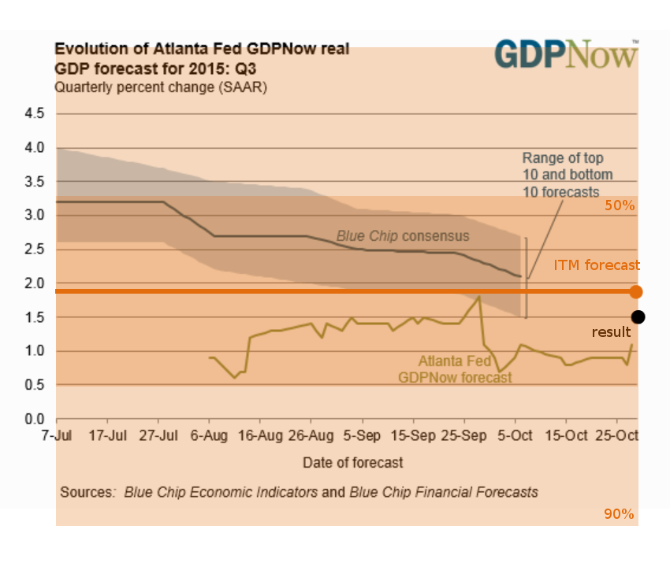
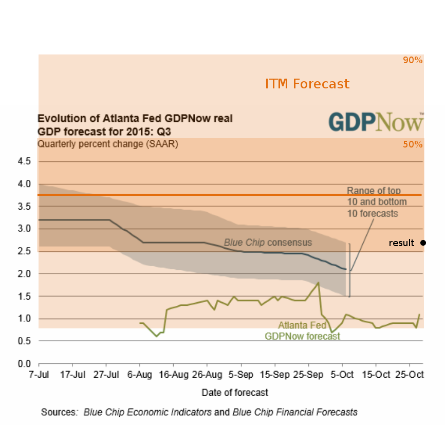

**Correction**:

GDPnow (and the Blue Chip consensus) is a forecast of real GDP, not nominal GDP as pointed out by eli below. Whoops. Should have noticed that "real" in the label on the graph. The result is basically in line with both projections and the ITM forecast based on PCE inflation. But again, that's more a statement of ignorance on the part of the ITM.

**Original (incorrect) post**:

So the advanced estimate of 2015 Q3 NGDP is in (2.7% NGDP growth) and it appears GDPnow and the Blue Chip consensus were a bit low. The Blue Chip consensus at least had some 'error' bands (a range).  [The ITM forecast](http://informationtransfereconomics.blogspot.com/2015/10/potentially-file-under-thinking-we-know.html) was right on (within the 50% confidence interval), but it's confidence intervals are so wide that that's more of a statement of ignorance:

