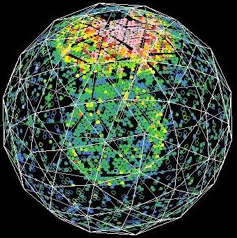
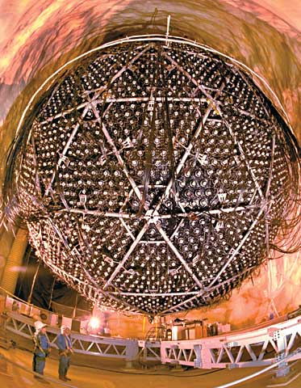

Congrats to the new [Nobel prize winners](http://www.nobelprize.org/nobel_prizes/physics/laureates/2015/press.html) in physics. I actually just mentioned neutrino oscillations [the other day](http://informationtransfereconomics.blogspot.com/2015/10/we-built-this-theory-on-scope-conditions.html). The [solar neutrino problem](https://en.wikipedia.org/wiki/Solar_neutrino_problem) was a pretty big deal for awhile there. Some of my fellow grad students worked on SNO and we had a pretty neat live feed of SNO events (pictured above). I recall a controversy about whether to dump some salts into the thousands of gallons of heavy water borrowed from the Canadian government to deal with background noise.
