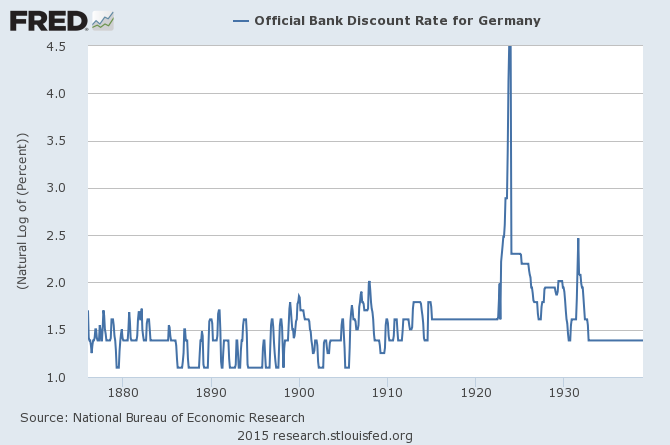

Another data point for [pegged interest rates](http://informationtransfereconomics.blogspot.com/2015/04/will-uk-be-first-to-exit-great-recession.html) leading to the [hyperinflation solution](http://informationtransfereconomics.blogspot.com/2013/09/hyperinflation.html) from [Brad DeLong](http://www.bradford-delong.com/2015/10/monday-smackdown-was-eugene-fama-always-such-a-total-moron.html). I didn't know that Weimar Germany had pegged interest rates.

