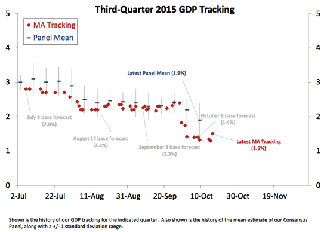

**Correction 10/29/2015:**
**Original post:**

I thought readers might be interested in (and entertained by) the rather vague [ITM forecast](http://informationtransfereconomics.blogspot.com/2015/07/comparing-ngdp-predictions-with-results.html) of NGDP for Q3 of 2015. It appears as the orange line above (the forecast has not changed since July of this year, so it is a horizontal line). The orange bands represent the 50% and 90% errors (roughly 0.6 and 1.6 sigma) based on data from 2010 Q1 - 2015 Q2.

The key take-away is that ITM sees most of the fluctuations of NGDP as random noise without seasonality -- it's supposed to be SAAR, anyway, right? A really high result could be seen as 'vindication' -- really just vindication of randomness. I'll probably just find it funny if the Q3 result does come in fairly high. The ITM doesn't really give you much more information than a log linear fit.

The [GDPnow](https://www.frbatlanta.org/cqer/research/gdpnow.aspx?panel=1) value from the Atlanta Fed may well be better (the source of the diagram above).

Does anyone know the 2015 Q3 prediction from hypermind? The site only has the 2015 annual level, which has gone down to 3.2% despite some upward revisions in previous quarters making me think it is giving a result closer to the blue chip or GDPnow value.

**Update 10/19/2015:**

Here's some results from Macro Advisors (H/T [Brad DeLong](http://www.bradford-delong.com/2015/10/must-read-macro-advisors-is-currently-at-a-25year-real-gdp-growth-rate-forecast-for-the-fourth-quarter-of-2015-a-15.html)) for **real** GDP:

