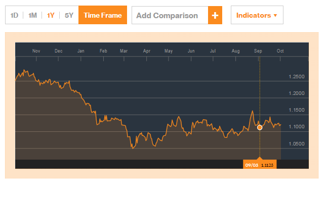

Scott Sumner [shows](http://www.themoneyillusion.com/?p=30769) the fall in the Euro (vs the Dollar, I believe) after Draghi's announcement to do whatever it takes at the beginning of September from 1.12 to 1.11. Here's a broader view from Bloomberg (September 3rd is marked):

This graph covers the region from about 1.25 to 1.05 -- about 20 times the range of the graph in Scott's post. By the standard of that graph, there appears to be several monetary policy events of equal size each month over the past year.

Another interpretation is that there are people in forex markets who trade on random dupes that try to trade on that "new" information. It doesn't sound like a good basis for a macroeconomic theory. The fall from the Draghi announcement vanishes into the noise in a few days, therefore it probably didn't matter that much.

In general, it appears that [markets make "mistakes"](http://informationtransfereconomics.blogspot.com/2014/11/is-market-monetarism-wrong-because.html) -- going in some direction based on macro policy announcements regardless of whether that macro policy will have the outcome it purports to have. This seems particularly significant [in forex markets](http://informationtransfereconomics.blogspot.com/2015/06/exchange-rates-and-irrational-markets.html).
