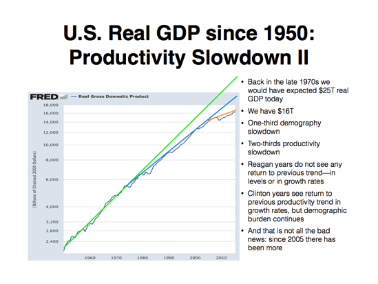

I mentioned theory-dependent 'facts' the other day, and here is a good example using a [Brad DeLong post](http://www.bradford-delong.com/2015/10/macro-situation-how-many-bullets-can-the-economy-dodge.html) from yesterday. Here is RGDP and the trends DeLong sees:

There is a 'fact' of two cases of RGDP/productivity slowdown. The information transfer (IT) model trend tells a different story with different 'facts' (this graph is the same result from [this post](http://informationtransfereconomics.blogspot.com/2015/03/potential-rgdp-and-forecast-rgdp.html)):

In this view, there hasn't been any falling productivity, just a trend towards a lower average RGDP growth rate. However, the more fundamental (and therefore better) measure in the IT model is NGDP:

I don't want to leave the impression that I am saying: _Ha, ha, DeLong is wrong!_ Maybe the IT model is wrong (although the NGDP path is pretty excellent, I must say). I just wanted to illustrate how different theoretical models lead to different interpretations of data -- different 'facts'. And different theoretical models lead to different questions (and therefore research). _Why has productivity slowed down?_ is a question you'd ask if you drew the trend lines DeLong drew; it's not a question that follows naturally from the IT model trend.

PS The NGDP path includes a demography slowdown component as changes in the growth rate of the labor force are the primary source of non-monetary changes. See [here](http://informationtransfereconomics.blogspot.com/2015/08/employment-doesnt-depend-of-inflation.html).
