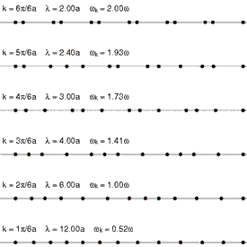

I wish I could write something clear enough because I think once I do David Glasner would champion the maximum entropy approach. Last night [he wrote](http://uneasymoney.com/2015/10/12/representative-agents-homunculi-and-faith-based-macroeconomics/) about representative agents having different properties from the micro agents. He used a traffic model as an analogy:

> _Consider a traffic-flow model explaining how congestion affects vehicle speed and the flow of traffic. It seems obvious that traffic congestion is caused by interactions between the different vehicles traversing a thoroughfare, just as it seems obvious that market exchange arises as the result of interactions between the different agents seeking to advance their own interests. OK, can you imagine building a useful traffic-flow model based on solving for the optimal plan of a representative vehicle?_

No, of course not. The 'representative vehicle' (that travels at some varying velocity, carrying a varying number of passengers) is an emergent degree of freedom that simplifies the theory.

In physics we have quasi-particles (collective excitations) like [phonons](https://en.wikipedia.org/wiki/Phonon). In fact, you'd probably describe a traffic model as a linear combination of vehicle phonons:

The atoms in a lattice don't travel anywhere, yet phonons (emergent waves that don't exist for individual atoms) carry the energy of a shock to the lattice across it. The properties of a material like its head heat capacity and temperature follow from maximum entropy distributions of phonons.

In the [information transfer traffic model](http://informationtransfereconomics.blogspot.com/2014/12/an-information-transfer-traffic-model.html), the underlying micro-theory vehicles have random velocities, yet the emergent 'representative vehicle' has a single \[stochastic\] velocity. It would be a mistake to associate the properties of the representative vehicle with the micro-theory vehicles.

In [this post](http://informationtransfereconomics.blogspot.com/2015/09/the-emergent-representative-agent-1.html), I construct a representative agent from a collection of micro-agents with completely different properties. Micro agents do not have transitive preferences, do not maximize consumption nor do any consumption smoothing; the representative agent has all of these properties (even a well-defined utility function).

Reading Glasner's post gave me the feeling that my blog is like screaming through sound proof glass. Here's Glasner just before the previous quote:

> _... what I was trying to argue was ... that representative-agent models suffer from an inherent, and, in my view, fatal, flaw: they can’t explain any real macroeconomic phenomenon, because a macroeconomic phenomenon has to encompass something more than the decision of a single agent, even an omniscient central planner._

I think Glasner means the representative agent solution can't explain any real macro phenomenon in terms of micro agents \[1\]. And that is true of the emergent representative agent. The micro agents and the representative agent have little in common (except maybe the properties allowed by the SMD theorem).

There is a separation between the micro agents and the macro properties and when this separation occurs, the macro properties (given by the representative agent) are the result of the bulk properties of the economic state space. Sometimes this separation doesn't occur (or breaks down), and the representative agent dissolves into a complicated simulation with millions of agents. This is the main point of [my earlier post](http://informationtransfereconomics.blogspot.com/2015/10/economics-as-and-versus-social-science.html) and the idea there is summarized in this graphic:

This happens in disordered systems (like glasses) as well as so-called meso-scale physics where the phonons become less well-defined. In that case there is no simplification, and you have to treat the problem as made up of millions of individual atoms \[2\].

The key thing to understand here is that the macro theory may have little or nothing to do with the micro theory. The theory of quarks has little to do with the theory of protons and neutrons (except some bulk properties). The theory of phonons (lattice excitations) has little to do with the theory describing an individual atom. The theory of an ideal gas has little to do with the theory of individual atoms. Actually, the emergent macro-theory tends to have more to do with just the symmetries and bulk properties of the state space rather than the details of the micro-theory.

In the quark case it's actually pretty interesting -- there is no scale at which both the quark and hadron theories are simple descriptions. At high energy, the quark theory simplifies. At low energy, the hadron theory simplifies \[3\]. In physics we call this [duality](https://en.wikipedia.org/wiki/Duality#Physics) -- sometimes the wave description of a quantum system simplifies and sometimes the particle description simplifies. Some phenomena are more easily seen as electric fields and moving charges, some phenomena are more easily seen in terms of magnetic fields.

For economic phenomena, sometimes the representative agent simplifies and sometimes micro-theory agents simplify.

Economics doesn't have a good way to tell which is applicable when ([scope conditions](http://informationtransfereconomics.blogspot.com/2015/10/we-built-this-theory-on-scope-conditions.html)) yet, but the information equilibrium model is a good start, IMHO.

**Footnotes:**

\[1\] If Glasner doesn't mean this and means that even an emergent representative agent can't be used, then I'd say we have disagreement. But we'd agree again if what he means is that an emergent representative agent can't be used when the economy is out of equilibrium (in a recession). That's non-ideal information transfer and I get to that in the last two paragraphs and the footnote below.

\[2\] This is [non-ideal information transfer](http://informationtransfereconomics.blogspot.com/2014/09/insights-from-non-ideal-information.html), and can be seen in an ideal gas where molecular forces become important (and the gas condenses into a liquid ... see link).

\[3\] I have a conjecture that this always happens.
