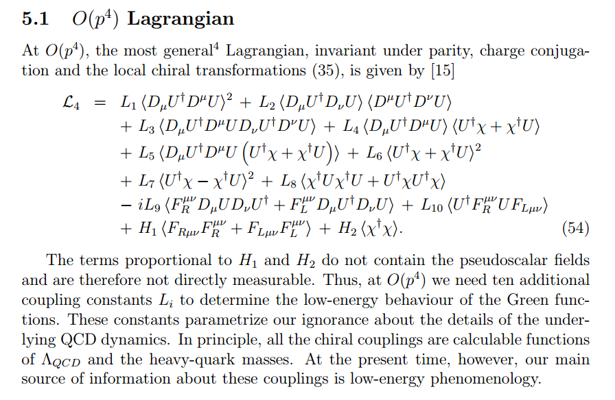

The [SMD theorem](https://en.wikipedia.org/wiki/Sonnenschein%E2%80%93Mantel%E2%80%93Debreu_theorem) says that the aggregate market demand curve only inherits a few properties from the individual demand curves: continuity, homogeneity of degree zero, Walras' law and a boundary condition that demand is large as prices go to zero.

This basically says that the aggregate theory doesn't necessarily have much to do with the individual agents ... that the SMD theorem is the "anything goes theorem" (at least from the Wikipedia article).

I've said [before](http://informationtransfereconomics.blogspot.com/2014/02/i-quantity-theory-and-effective-field.html) that homogeneity of degree zero seems to be a symmetry principle for economics. And Walras' law (that I've looked into before: [here](http://informationtransfereconomics.blogspot.com/2013/09/walras-law.html) and [here](http://informationtransfereconomics.blogspot.com/2014/08/walras-law-information-theory-edition.html)) is something like a conservation law. In physics, we'd say that there is a macro scale and a micro scale instead of aggregate market and individual agents, respectively. Translating the SMD theorem into these physics terms, we have the statement:

> _The theory at the macro scale only inherits conservation laws and symmetry principles from the theory at the micro scale._

That is exactly the idea behind constructing an [effective](http://informationtransfereconomics.blogspot.com/2015/08/definitions-information-and-effective.html) field theory!

See the link for the definition of effective as it's used here. Let's say we start with the fundamental theory of quarks and gluons, [QCD](https://en.wikipedia.org/wiki/Quantum_chromodynamics). It has an _SU(3)_ symmetry (color) an (approximate) _SU(2)_ symmetry (weak isospin/chiral) and an _SO(3,1)_ symmetry (Lorentz), and obeys the basic conservation laws of physics (momentum, energy). Now QCD is impossible (well [almost impossible](https://en.wikipedia.org/wiki/File:Fluxtube_meson.png) -- nice job!) to solve at the "macro" scale, so what do we think it looks like?

Well, if we put the theory in a [Lagrangian](https://en.wikipedia.org/wiki/Lagrangian_\(field_theory\)) that takes care of the conservation laws \[1\]. Do we have a theory of a representative quark? That doesn't make sense, really. Quarks need to come in pairs or triplets to cancel their color charge. In economics, agents actually need to sell stuff to each other so you can't really have just one agent \[2\].

So what do we observe at the macro scale? Protons, neutrons, [pions](https://en.wikipedia.org/wiki/Pion), ... hadrons. In macroeconomics, people have constructed aggregates like the price level and NGDP. Macro is primarily concerned with these aggregates. So hadrons on one hand and macro aggregates on the other are our "particle content".

In physics, we then put these together into terms in the Lagrangian in ways that maintain the symmetries \[1\]. It's mostly a process of index matching where you make sure there aren't any hanging spacetime indices (Lorentz symmetry) or isospin indices (chiral symmetry), etc. The key thing to understand is that an effective field theory (like [chiral perturbation theory](https://en.wikipedia.org/wiki/Chiral_perturbation_theory) \[3, 5\] with empirical parameters _Fπ_ and _mπ_) can look totally different from its microscopic (fundamental) theory (like [QCD](https://en.wikipedia.org/wiki/Quantum_chromodynamics#Lagrangian) with only one parameter _gs_ \[4\]).

I think this is the heart of the SMD theorem. The effective theory of macroeconomics can (and probably does) look entirely different from the fundamental theory of microeconomics.

The call for microfoundations was basically a call for a quark and gluon mechanism for any chiral perturbation theory result. That would be tedious. I can calculate a pion scattering cross sections more easily using _Fπ_ and _mπ_ with _Fπ_ measured empirically than I can from setting up a lattice calculation to calculate _Fπ_ from QCD. Additionally, there is no parameter _Fπ_ for a single quark! The pion decay constant _Fπ_ only makes sense for a pion.

And there we can make a connection to the information equilibrium approach: we measure the information transfer (IT) index _k_ (or kappa) empirically. You could potentially calculate _k_ from a large simulation of individual agents ... and more power to those that want to try. But _k_ does not exist for an individual agent -- it is a property of aggregate agents. \[5\]

The bottom line is that representative agents (at the micro scale) and microfoundations assume the structure of the effective macroeconomic theory. They represent massive limitations of the possibilities -- and from what I've seen, may even exclude the real theory of macroeconomics.

**Footnotes:**

\[1\] I'd like to think of information equilibrium relationships as the equivalent to Lagrangians that essentially guarantees Walras' law and homogeneity of degree zero.

\[2\] Is there macro money confinement? At the macro scale we never see money outside a transaction? Potentially interesting ... but total speculation.

\[3\] Chiral perturbation theory was such a good paradigm in the development of this whole idea in physics that sometimes people say effective field theory (the general term) to mean chiral perturbation theory (a specific effective field theory of QCD).

\[4\] Chiral QCD has massless quarks.

\[5\] As I mention in a footnote in [the paper](http://informationtransfereconomics.blogspot.com/2015/08/information-equilibrium-as-economic.html), as well as at the [effective field theory post](http://informationtransfereconomics.blogspot.com/2014/02/i-quantity-theory-and-effective-field.html) mentioned above, the information equilibrium model I present may only be the leading order effective theory. We have 

_dD/dS = k D/S + c (D/S) (dD/dS) + ..._

For chiral perturbation theory, the Lagrangian gets pretty unwieldy pretty fast:

