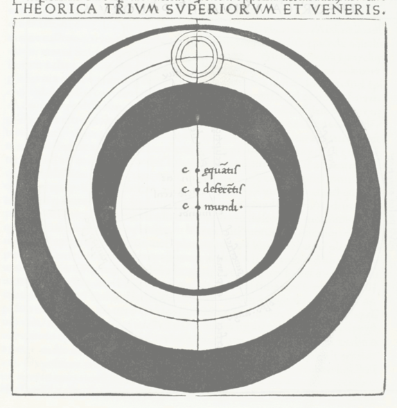

> If humanities scholars made more convincing arguments—prizing facts over rhetoric—we might listen to their lectures. [http://t.co/E5nOw38ZwJ](http://t.co/E5nOw38ZwJ)
>
> — Justin Wolfers (@JustinWolfers) [October 18, 2015](https://twitter.com/JustinWolfers/status/655831974733598720)

> Weird how quickly economists got over the whole "half of our most major studies can't be replicated" thing. [pic.twitter.com/v6DUMTRZXd](http://t.co/v6DUMTRZXd)
>
> — Sean McElwee (@SeanMcElwee) [October 18, 2015](https://twitter.com/SeanMcElwee/status/655852777994874880)

[Atrios](http://www.eschatonblog.com/2015/10/the-worlds-worst-humans.html) gave Justin Wolfers one of his world's worst humans 'awards' for his rather stunning lack of reflection. My co-worker and I happend to discuss Kuhn the other day and it is particularly relevant here. I'll just quote from [this summary instead of Kuhn](http://plato.stanford.edu/entries/thomas-kuhn/) directly because it's shorter:

> _The theory-dependence of observation, by rejecting the role of observation as a theory-neutral arbiter among theories, provides another source of incommensurability. Methodological incommensurability ... denies that there are universal methods for making inferences from the data. The theory-dependence of observation means that even if there were agreed methods of inference and interpretation, incommensurability could still arise since scientists might disagree on the nature of the observational data themselves._

In a sense, there is disagreement between humanities and social science/economics over what constitutes fact. And that's because you need theory in order to make sense of facts. There is no such thing as theory-neutral facts.

For example, a sociologist or historian might consider an economic system in terms of [institutions](https://en.wikipedia.org/wiki/Historical_institutionalism). In that case the existence of institutions (law, marriage and family, religion, media, ...) counts as an important fact in moving towards understanding the system. And in fact, there are institutions!

Now contrast this with an economist considering an economic system in terms of utility maximization with (possibly bounded) rationality. We don't really know if this is true -- many experiments and 'stylized facts' seem to show we're not terribly rational as humans: money illusion, endowment effect, hyperbolic discounting, etc \[1\]. Therefore the construct you are attempting to understand the system with may not actually exist.

As an analogy, Wolfers was potentially saying: if other people made more convincing arguments -- prizing [crystal spheres](https://en.wikipedia.org/wiki/Celestial_spheres) over rhetoric -- maybe we'd listen to you about astronomy.

We don't know if utility maximizing agents exist (much like how Aristotle didn't know if crystal spheres existed), but we do know institutions exist.

Now it is entirely possible (even likely) institutions are not the best way to understand economics. But I think it is more likely utility maximizing agents (even including perturbations around rationality) are the crystal spheres of economics -- and that utility maximization represents an unscientific approach to economics.

**Like crystal spheres, utility maximizing agents have not been observed.**

Even experiments in economics (that won a Nobel prize) [don't really observe utility maximizing agents](http://informationtransfereconomics.blogspot.com/2015/01/im-not-sure-economists-understand.html). They observe that given well-ordered preferences (i.e. defined by real numbers), agents maximize utility. But that's a bit like saying given utility and told to maximize agents maximize utility. The best predictive result in economics that Noah Smith is fond of pointing out [used a random utility model](http://informationtransfereconomics.blogspot.com/2015/07/random-utility-discrete-choice-models.html) (that isn't terribly different in structure to the partition function approach on this blog). Some of the most robust findings in economics are **deviations** from utility maximizing agents (money illusion, hyperbolic discounting, endowment effect). Utility maximizing agents do not seem to have been observed -- if you can think of any experiments that observe them, let me know in comments!

**Ok, what about atoms and statistical mechanics?**

Yes, atoms were not observed when they were postulated. However, when atoms were postulated, they were considered too small to be observed. Crystal spheres are actually more scientific than utility maximizing agents because crystal spheres were thought too far away to be observed. Utility maximizing agents are a model of human beings -- they are readily observable.

**Like crystal spheres, utility maximizing agents are motivated by a specific philosophy.**

Utility maximizing agents are motivated both by utilitarianism (Bentham, Mill) and how self-interest can self-regulate (Adam Smith). The crystal spheres are motivated by the idea that circles are perfect and that the universe itself must be perfect.

**Like crystal spheres, utility maximizing agents make calculations tractable given mathematical tools at the time.**

Sure, many epicycles and deferents were added to the crystal sphere model to make it more accurate -- regressions hadn't been invented, but would have greatly simplified the process. in the end, it's just geometry and Anaximander was a contemporary of Thales. Utility maximizing agents solve Lagrange multiplier problems invented in the 1700s (Lagrange was a contemporary of Adam Smith).

I just thought that last one was interesting. Most mathematical solutions to problems use mathematics available at the time. An exception is string theory which is not really tractable except in maybe the most symmetric of cases.

Utility maximizing agents: not observed (when they should be) and motivated by a specific philosophy (only) equals unscientific (in my view) \[2\].

But then, it is the standard approach in economics, so I will dutifully express information equilibrium results in terms of epicycles, I mean, utility maximizing agents and perturbations from rationality.

**Footnotes:**

\[1\] Note that these things exist as stylized facts because of the utility maximizing framework. They might not be deviations in the 'correct' economic theory. It's like having a frame where all swans are black and saying: except that white one ... and that white one ... and that white one.

\[2\] You might ask: how does the information equilibrium approach fare under these criticisms? Well, information has been observed (it runs communication theory) and it's not motivated by a specific philosophy. There are [general philosophical motivations](http://informationtransfereconomics.blogspot.com/2013/04/the-philosophical-motivations.html) (more for the methodological approach -- Kuhn's differing weights of simplicity, scope, accuracy, fruitfulness and consistency) but it doesn't really depend on a particular world-view. Unless you count nihilism -- I am motivated by a nihilistic approach to economics, that macroeconomic aggregates are as meaningless as the universe. We largely can't know the future and in the cases where we can, we can't change it.
