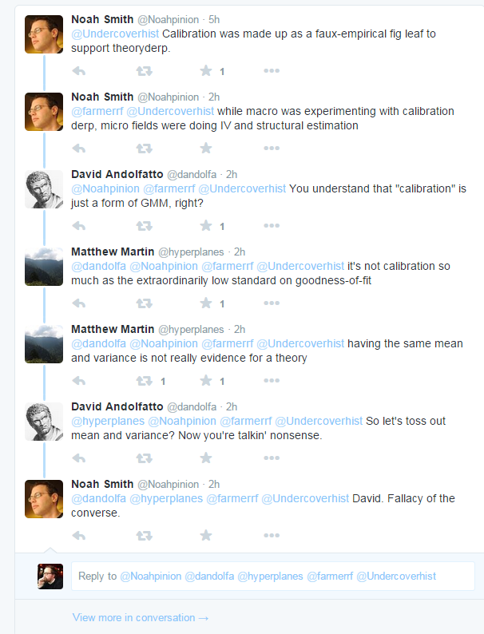

I've been reading [Noah Smith](http://noahpinionblog.blogspot.com/2015/09/theory-vs-data-in-economics.html)'s latest post over and over and I'm not quite sure I get the point. My summary:

> Economics wasn't very empirical, so theories used to be believed for theoretical reasons. Then along came data in the form of natural experiments, but these ruled out theories. Natural experiments have limited scope and don't tell you what the right theory is. This creates a philosophical crisis that manifests as an adversarial relationship between theory and data that will work itself out.

Sounds like an irrational three year old with fingers in ears saying _La-la-la ... I can't hear you!_ when it's time to go to bed. That's pretty funny because the rational agent stuff tends to be what is being killed.

Actually, physics is dealing with the exact same problem (with dignity and grace). We have the standard model and general relativity (aka "[the core theory](http://www.preposterousuniverse.com/blog/2015/09/29/core-theory-t-shirts/)"). There have been several natural experiments (supernovas telling us the expansion of the universe is accelerating, solar neutrino oscillations) that have 'proven' the core theory 'wrong' in ways that don't tell you what the right theory is. But there is no philosophical crisis and no adversarial relationship.

Noah chalks that up to a long tradition of empiricism in physics, but I disagree. It is the existence of a [framework](http://informationtransfereconomics.blogspot.com/2015/05/frameworks-and-bohr-model-analogy.html) that says that even though the core theory is wrong about neutrino oscillations and the accelerating universe, it's still right about the things that it is right about. That's because of what Noah (in the [prior post](http://noahpinionblog.blogspot.com/2015/09/a-bit-of-pushback-against-empirical-tide.html)) says physicists call 'scope conditions' (that is fine although the first google reference is to sociology, and _domain of validity_ and _scale of the theory_ were terms more commonly used by this physicist). It's actually the funniest line of that prior post:

> _I have not seen economists spend much time thinking about domains of applicability (what physicists usually call "scope conditions"). But it's an important topic to think about._

Yes. That does sound like an important thing to think about. I have this theory. Under what conditions does it apply? Maybe we should look into it ... 

Ya think?

At least "we should look into it" is better than [Dani Rodrik's](http://informationtransfereconomics.blogspot.com/2015/09/whats-wrong-with-dani-rodriks-view-of.html) assertion that the scope conditions are just whatever the model assumed in order to model a specific effect. The IS-LM model is limited to the Great Depression. DSGE models are limited to the period of the Great Moderation in the US. A model of the lack of impact on unemployment of that minimum wage increase in New Jersey from 4.25 to 5.05 in 1992 Noah mentions in his post is restricted to that minimum wage increase from 4.25 to 5.05. In New Jersey. In 1992.

Anyway, physicists' so-called scope conditions mean that discovering neutrino oscillations or a positive cosmological constant doesn't burn through your theory like a building without firewalls or fire doors.

The econ 101 model of a minimum wage rise causing unemployment doesn't actually have any scope conditions. So that minimum wage increase in NJ burns down the econ 101 model of minimum wages. To the ground. Rodrik tries to put in a firewall and say that the natural experiment should only burn down the econ 101 theory when you go from 4.25 to 5.05 in NJ in 1992.

But that brings us to an even more important point. You can't interpret a natural experiment without a framework that produces scope conditions. How do you know if you've isolated an external factor if you don't know what the scale of the impact of that external factor is? The real answer is 'you can't', but economists have been trying to get around it with [instrumental variables](https://en.wikipedia.org/wiki/Instrumental_variable) and [structural estimation](https://en.wikipedia.org/wiki/Structural_estimation).

Structural estimation is the idea that you could make up a plausible argument for _X_ to depend on _Y_ but not _Z._ Instrumental variables is the idea that ... you can make up a plausible argument for _X_ to depend on _Y_ but not _Z_.

Anyway, those plausibility arguments are basically hand-waving scope conditions, but without a framework you have no idea what the size of the domain of validity is. As Noah says: "you have an epsilon-sized ball of knowledge, and no one tells you how large epsilon is."

The other way to get around the issue of  data rejecting your theory and lack of scope conditions (thus the data burning your entire theory down) is to relax your definition of rejection. One way of doing that is called calibration. And all of these ran into each other on twitter today:

Basically we have this ...

Problem: Data rejects our theory and without the firewalls of scope conditions, it burns the entire theory down

Solution 1: Scope conditions are limited to original purpose of theory (Rodrik)

Solution 2: Hand-waving about scope conditions with instrumental variables

Solution 3: Relax definition of "rejects" with calibration

Let it burn was apparently not an option.

...

PS I'm sure you want to ask about the scope conditions (domain of validity) of the information equilibrium models. Well, the scope of any particular model consists of its equilibrium relationships between its process variables. If data rejects the market information equilibrium relationship $A \rightleftarrows B$, then that relationship is rejected. If the model is made up of more than one relationship, but depends on the rejected relationship, then the model is rejected. That should make intuitive sense: either information flows between $A$ and $B$ or it doesn't. And if part of your model requires information to flow between $A$ and $B$ and it doesn't, then your model is wrong.

PPS This post started out with my personal opinion that if a particular statistical method matters in rejecting or accepting your model, then your model probably doesn't tell us much.
