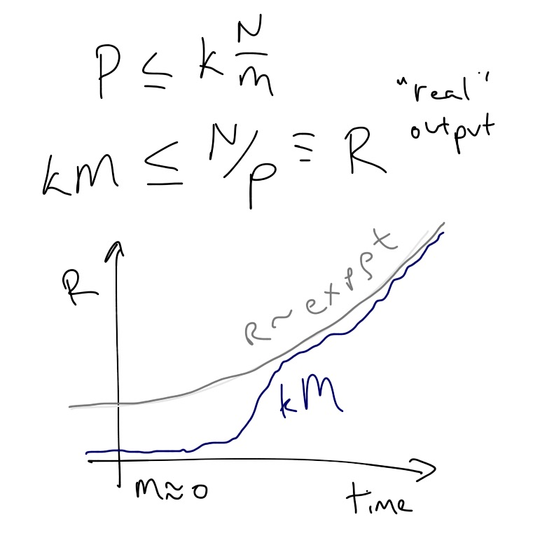

Commenter John Handley points out (correctly) that Paul Romer is talking about real output, while in [my previous post](http://informationtransfereconomics.blogspot.com/2015/10/can-we-extrapolate-growth-into-distant.html), I talk about the price level. The problematic extrapolation from RGDP growth rates doesn't really depend on using real output or the price level (specifically, the physical analogy I wrote down); I was attempting to connect the result to a previous result about [the price revolution](http://informationtransfereconomics.blogspot.com/2015/09/the-price-revolution-and-non-ideal.html) of the 1500s (or so).

So I went back and re-worked the result in terms of real output (_R_) with real growth rate _ρ_ (i.e. _R ~ exp ρ t_). I also made use of some stuff from the section on the AD-AS model [in the paper](http://informationtransfereconomics.blogspot.com/2015/08/information-equilibrium-as-economic.html). Using the market (information equilibrium relationship) _P : N ⇄ M_ we can show

_k M ≤ R ≡ N/P_

And the picture we produce is very similar to the price level one and has the same interpretation -- simply extrapolating back with constant real growth rate _ρ_ doesn't capture the fact that there probably wasn't a monetary economy in the past:

What's also interesting is if we assume information equilibrium and use the "money mediated AD-AS model" from the paper, i.e.

_N ⇄ M_ _⇄ S_

we can show that, if _k ≡ kn/ks_ where _kn_ is the IT index of the market _N ⇄ S_ and _ks_ is the IT index of the market _M ⇄ S_, we have the information equilibrium relationship _R ⇄ S_ with IT index _ks_. That means

_R ~ exp ρ t ~ exp ks σ t_

where σ is the growth rate of aggregate supply. Therefore _ρ = ks σ_. The real rate of growth _ρ_ is only proportional to the rate of growth σ of aggregate supply widgets. See the derivation in the postscript below.

We don't know if _ks_ is changing or even what its value is (except that it is of order _kn_ in order for _k ~ 1_ empirically). It could be greater than one or less than one. Therefore so-called real output doesn't necessarily represent real widgets, but rather some conversion of physical widget units to money units. We have _R ≡ N/P = N/(dN/dM)_ so the units of real output are the units of _M_ (i.e. dollars).

An argument about real growth isn't an argument about physical widgets, so saying 2% real growth extrapolated backwards to the year 1000 is a small number doesn't tell you anything about the number of physical widgets. If _ks_ \> 1, then _σ_ < 2% and the number of physical widgets in the year 1000 could be much greater than would be surmised from a tiny value for _R_.

Of course, this is a model dependent result. And that is the point -- Romer's argument that real growth has been accelerating is also model dependent.

...

PS Here are more details of the derivation (in long hand):

