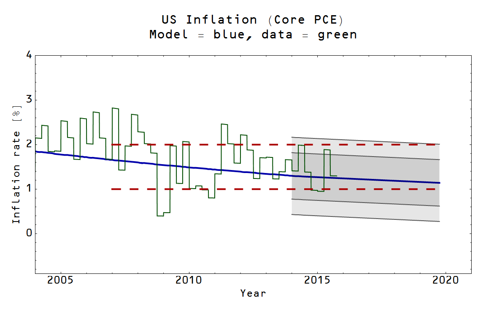

I mentioned [David Beckworth's corridor](http://macromarketmusings.blogspot.com/2014/08/about-fed-not-trying-hard-enough-to-hit.html) in [comments on an earlier post](http://informationtransfereconomics.blogspot.com/2015/11/does-market-monetarism-exist-in.html?showComment=1448248795247#c8730193735367893546) and realized ([again](http://informationtransfereconomics.blogspot.com/2015/09/prediction-aggregation-redux.html)) I hadn't updated the graph from [here](http://informationtransfereconomics.blogspot.com/2014/08/smooth-move.html). This one correctly plots quarterly data (instead of monthly) along with quarterly error (using the IT model prediction for core PCE inflation listed [here](http://informationtransfereconomics.blogspot.com/2015/09/prediction-aggregation-redux.html); see links for model details).

Beckworth's model does show where QE1 and QE2 take off, but might be construed to have predicted QE4 at the end of 2014 -- which did not happen.

Looks like next year or two we'll start to get some real action (in the sense of which model is better) on this one. Basically, the IT model plus Beckworth's model (they're not inconsistent with each other if you don't take QE-n to _cause_ anything) predicts a high likelihood of QE4. Considering how the Fed seems anxious to **raise** rates, this could be interesting.
