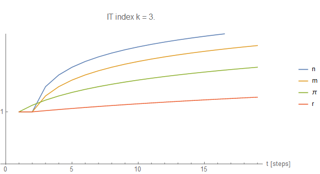

Well, the original idea of [this post](http://informationtransfereconomics.blogspot.com/2015/11/dsge-form-of-it-model-interactive.html) was to have an interactive version of the DSGE form of the IT model:

Oh, well. [Here is the original source](http://informationtransfereconomics.blogspot.com/2015/10/interest-rate-dynamics.html) for the graph -- it's showing the effect of a monetary expansion (m, yellow) on output (n, blue), inflation (π, green) and interest rates (r, red) depending on the value of the information transfer (IT) index. This is short run (DSGE form is log-linearized, so is only true over a few time steps).
