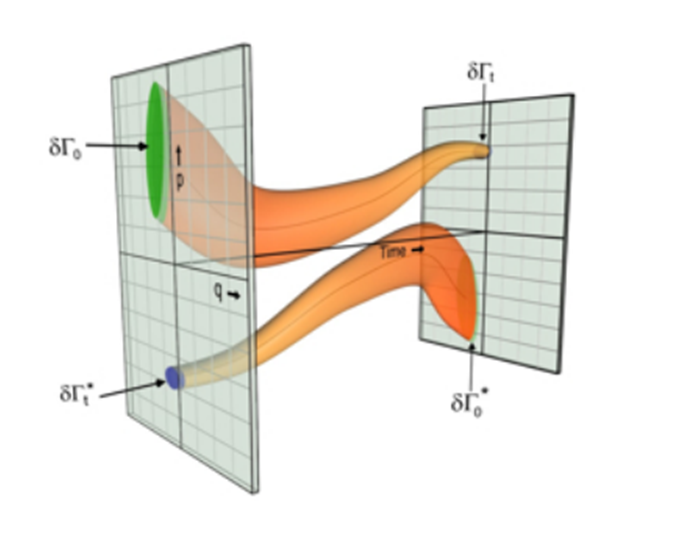

_File under speculative theory_

[Cullen Roche mentioned Greece today](http://www.pragcap.com/why-no-one-should-support-the-gold-standard/) and that inspired me to take on internal devaluation:

> _... Greece ... exists in a single currency system with no floating exchange rate.  Greece is experiencing the equivalent of a gold standard style “internal rebalancing” where they suffer through a long sustained deflation that makes their economy more competitive._

For the standard economic narrative on this subject, here's [Paul Krugman](http://krugman.blogs.nytimes.com/2012/07/29/internal-devaluation-inflation-and-the-euro-wonkish/).

And here's why I think it might be such a difficult grinding process in terms of the information transfer model. In the [paper](http://informationtransfereconomics.blogspot.com/2015/08/information-equilibrium-as-economic.html) I discuss how changes in nominal output (_ΔN_) are like the second law of thermodynamics for economics. In an ideal world where humans didn't act in concert (i.e. panic after a major stock market crash), we would have (on average, with a large economy):

_ΔN ≥ 0_

Atoms in an ideal gas don't suddenly decide to go to one side of the container (reducing entropy _ΔS < 0_), but humans can and will decide they want to get out of the stock market all at the same time. That allows _ΔN < 0_.

However even in thermodynamics you can have _ΔS < 0_, but only on a small scale. For microscopic engines, you can get the equivalent of an engine running backwards, sucking in exhaust and producing fuel (and it is relevant for biological machines like a ribosome or a flagellum). It's called [the fluctuation theorem](https://en.wikipedia.org/wiki/Fluctuation_theorem). You derive it by looking at the evolution of phase space going forward and backward in time, and the picture you should have in your head is something like this from [Sevick et al](http://arxiv.org/abs/0709.3888):

The fluctuation theorem predicts a specific form of this violation of the second law of thermodynamics -- essentially an exponentially decaying function (which is actually observed, see e.g. [here](http://www.nature.com/nnano/journal/v9/n5/fig_tab/nnano.2014.40_F3.html)). Now I haven't formally proved that this carries over into economics, but if _ΔN_ is analogous to entropy then the picture we have is like [Figure 20 from the paper](http://informationtransfereconomics.blogspot.com/2015/08/information-equilibrium-as-economic.html):

The green highlighted region indicates the strong violation of the 'second law' where _ΔN < 0_ due to panics and 'herd behavior', but some quarterly falls in NGDP would be consistent with a 'economic fluctuation theorem' (red highlighted region). In this picture, it is this piece of the distribution that would be analogous to the process 'internal devaluation'.

Does this offer any additional insight into macroeconomics?

Well, for one thing, it means that internal devaluation is easier for a smaller economy than a larger one. It is easier for a ribosome to operate backwards (thermodynamically) than a car engine.

In general, it should be a slow process since that region is exponentially small compared to the full distribution.

Additionally, for a small economy generally with an IT index _k > 1_, internal devaluation should also result in more deflation than for a larger economy with an IT index _k ~ 1_. Note that Paul Krugman has indicated that [the lack of deflation was a puzzle](http://krugman.blogs.nytimes.com/2013/04/13/missing-deflation/) (although Japan did experience deflation, so this isn't cut-and-dried).
