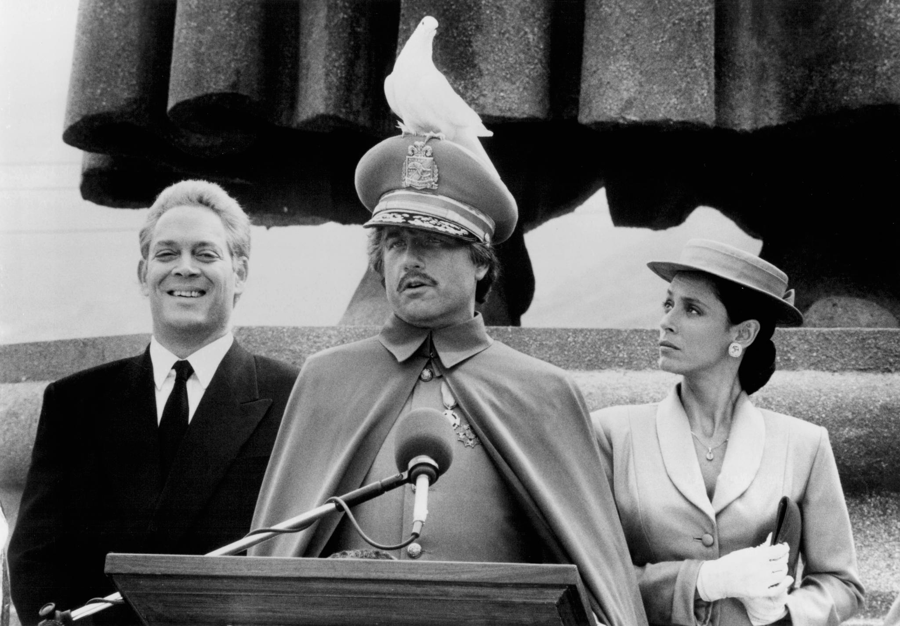

Today Nick Rowe [mentions](http://worthwhile.typepad.com/worthwhile_canadian_initi/2015/11/is-two-the-new-zero.html) the [dictator/ultimatum game](https://en.wikipedia.org/wiki/Dictator_game) (I choose to divide a pot and if you refuse the division, we both get nothing ... or the dictator version where you get no input). [It's another case where the maximum entropy guess is better than game theory](http://informationtransfereconomics.blogspot.com/2015/09/maximum-entropy-better-than-game-theory.html). Game theory says the solution is _99.9%_ (or more) for the dictator and _x = 0.1%_ (or less) for the other person if people were truly rational. Maximum entropy guesses _x ≈ 50%_, but allows _x ≤ 50%_ if information transfer is non-ideal. It also would guess _x = 33%_ for three players, _x = 25%_ for four, etc.

More on the rest of Nick's post later, but it brings up [this again](http://informationtransfereconomics.blogspot.com/2015/11/miracles.html). And [this](http://informationtransfereconomics.blogspot.com/2015/11/on-limits.html).
