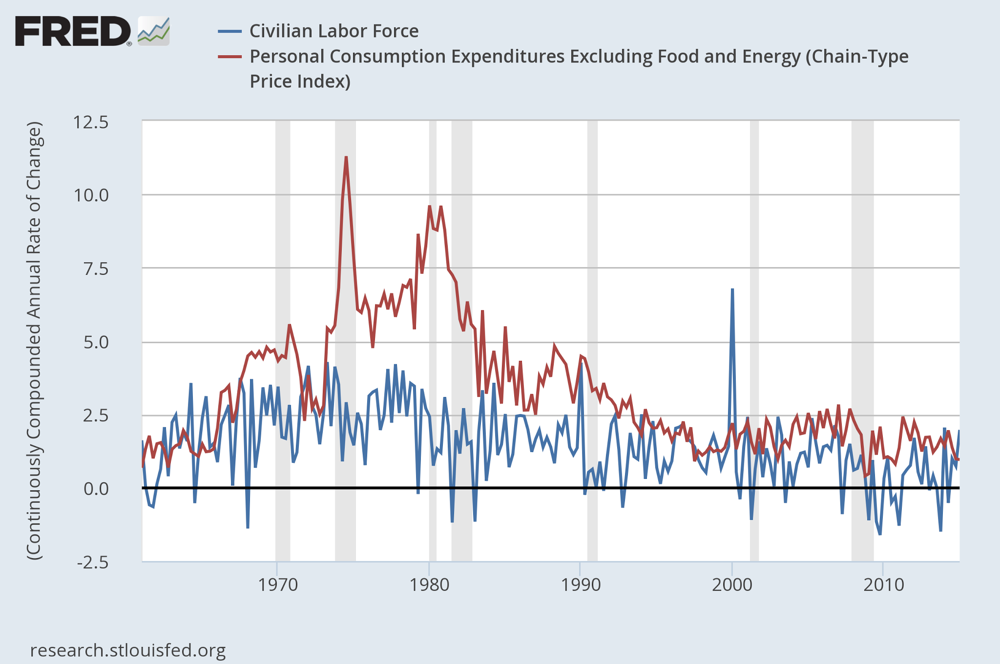

Scott Sumner [says](http://www.themoneyillusion.com/?p=30854):

> _The 2% inflation rate since 1990 would be an amazing coincidence, almost a miracle._

Is it?

This is another place where reasoning using [scales](http://informationtransfereconomics.blogspot.com/2015/11/on-limits.html) and [dimensional analysis](http://informationtransfereconomics.blogspot.com/2015/11/temporal-shapes-of-discount-factors-and.html) would really help. A 2% inflation rate sets a time scale (it is per year) so _t = 1/π_. For it to be a miracle (i.e. a [fine tuning problem](https://en.wikipedia.org/wiki/Fine-tuning)) that the Fed's (implicit) target and the inflation rate to match up there would have to be no other scales _T ≈ t_. So we should ask: _Are there any other time scales T in a nation such that T ≈ t  from 1990 on besides the central bank target?_ 

Actually employment growth (_T = 1/λ_) matches up pretty well too, including the times before 1990. Nearly all of the major differences are recessions:

The information equilibrium model gives a mechanism for _t = 1/π ≈ 1/λ = T_ for this latter example [through nominal shocks](http://informationtransfereconomics.blogspot.com/2015/08/employment-doesnt-depend-of-inflation.html).

Something that would be a major coincidence (i.e. finely tuned) if it wasn't the result of some underlying theory is the Grand Unified Theory [(GUT) scale](http://www.clab.edc.uoc.gr/materials/pc/proj/running_alphas.html):

Another place where the value of a parameter considered something of a miracle is the [strong CP problem](https://en.wikipedia.org/wiki/Strong_CP_problem). It's somewhat of a miracle that the CP-violating term of the QCD Lagrangian is about a trillion times too small. It's such a fine-tuning problem that the axion was proposed to fix it.

But there exists at least one scale _T_ that is approximately equal to _t_ (i.e. _π ≈ λ_), so it's not necessarily a miracle that inflation is on the order of 2%.

Actually, it's more of a miracle that central banks chose to (implicitly) target 2% inflation. A larger target might have shown [persistent undershooting](http://informationtransfereconomics.blogspot.com/2015/10/core-pce-inflation-update.html) earlier. However, the Fed never announced an explicit inflation targeting policy, and only has said 2% is consistent with its mandate more recently. Overall, the onset (1990s) and explicit target (about 2%) have a lot of wiggle room. And saying the Fed has targeted 2% PCE inflation does not explain the unbroken trend towards lower inflation since the 1980s (something that comes out of the IT model: see [here](http://informationtransfereconomics.blogspot.com/2014/05/out-of-sample-predictions-with.html) or [here](http://informationtransfereconomics.blogspot.com/2014/07/notes-from-ben-bernanke-and-p-model.html)).

...

PS I don't really want to link to the Insane Clown Posse, but their music video _Miracles_, which Brad DeLong frequently [posts a screenshot from](http://delong.typepad.com/sdj/2013/02/wonkblog-no-marco-rubio-government-did-not-cause-the-housing-crisis.html) is immediately what I thought of when Scott called 2% inflation in the absence of effective central bank targeting a 'miracle'. In it, the ICP asks "#$%@ magnets; how do they work? And I don't want to talk to a scientist ..." Anyway, that's the rationale for the title.
