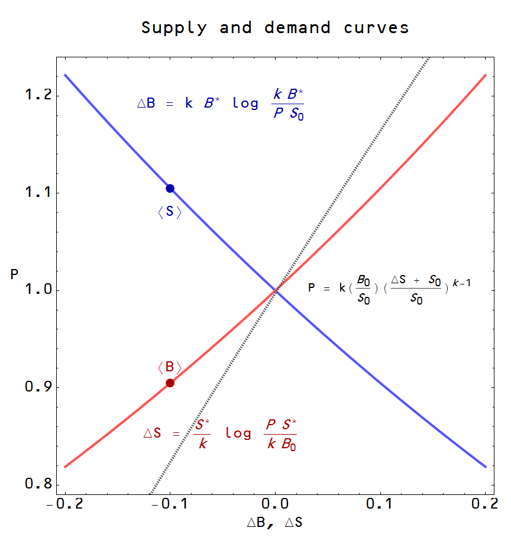
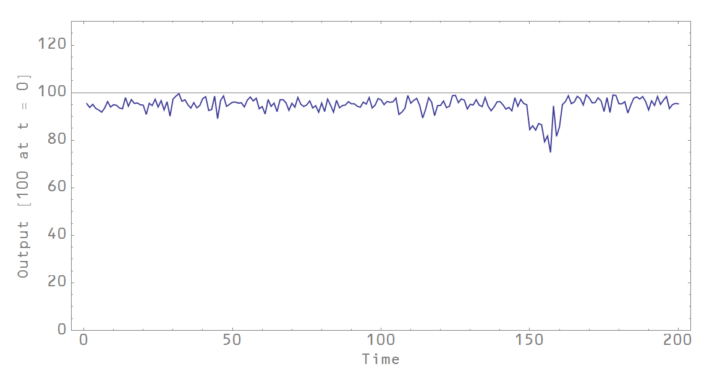

Paul Krugman has called the [baby-sitting coop](http://www.slate.com/articles/business/the_dismal_science/1998/08/babysitting_the_economy.html) -- see here for original paper \[[pdf](http://cda.morris.umn.edu/~kildegac/Courses/M&B/Sweeney%20&%20Sweeney.pdf)\] -- his "[favorite economic parable](http://web.mit.edu/krugman/www/MINIMAC.html)". It explains how recessions can be the result of poor monetary policy, that a lack of money (or in this case, baby-sitting scrip or coupons) can lead to lower output (fewer baby-sitting jobs). I've talked about it briefly before [here](http://informationtransfereconomics.blogspot.com/2015/01/i-strongly-disagree-with-what-you-are.html). Let's put this parable into a formal information transfer model. Start with information equilibrium between the scrip (_S_), each coupon good for 30 minutes of babysitting, and the babysitting jobs (_B_).

_P : B ⇄ S_

Note that a babysitting job can potentially cost several coupons. That is our shorthand for a differential equation (see [the paper](http://informationtransfereconomics.blogspot.com/2015/08/information-equilibrium-as-economic.html)) that has the solution (in general equilibrium):

_B/B₀ = (S/S₀)ᵏ_

The 'price level' is:

_P = k (B₀/S₀) (S/S₀)ᵏ⁻¹_

With this model, we have supply and demand curves in partial equilibrium where _X_ stays near _X\*_ on the time scale that _Y_ (the other process variable) changes (see [the paper](http://informationtransfereconomics.blogspot.com/2015/08/information-equilibrium-as-economic.html), with _ΔX ≡ X - X₀_):

Already we have some basic mechanics described in the paper and by Krugman:

-   Depending on the value of _k_, the price level could be stable (_k = 1_), rise (_k > 1_, inflationary pressure) or fall (_k < 1_,  deflation)
-   If scrip _S_ falls, then babysitting _B_ will fall in general equilibrium. Printing more scrip will allow babysitting to rise.

However, there is another bit of dynamics not captured in the mainstream economic model version that is present in the information transfer framework. It's called [non-ideal information transfer](http://informationtransfereconomics.blogspot.com/2015/03/non-ideal-information-transfer-tail.html). In general, the information in the spatial and temporal distribution of babysitting jobs is greater than the information in the spatial-temporal distribution of scrip (not everyone who wants to babysit can babysit) so:

_I(B) ≥ I(S)_

_P : B → S_

_P\*_

_P\* ≤ k (B₀/S₀) (S/S₀)ᵏ⁻¹_

And if _B\*_ is the non-ideal level of output and _P_ is the ideal price level, then

_P\* S/k = B\* ≤ B = P S/k_

Which means you can have a recession _without it being caused by a lack of scrip_. And this should actually happen sometimes. If you say there are a lot of time periods (say weeks) and a lot of people in the babysitting coop, even random behavior [will tend to saturate this bound](http://informationtransfereconomics.blogspot.com/2015/10/when-is-intertemporal-budget-constraint.html). But occasionally, [it will be less](http://informationtransfereconomics.blogspot.com/2015/09/a-random-walk-inside-simplex.html) even if there is sufficient scrip. It could look something like this:

The line at 100 represents information equilibrium level of output _B_. At time _t = 150_, we have _B\* ≤ B_ (a recession) due to non-ideal information transfer. Now it doesn't have to be random behavior causing it (it still could be) -- it could be a broken market or some complex behavior such as a subset of the coop deciding to go out all at the same time. Or everyone works for the government and there's a shutdown (the coop story was originally in Washington DC).

Also, even the non-ideal information transfer could be alleviated by a temporary increase in the level of scrip (which moves the information equilibrium bound up):

The babysitting coop is traditionally used as an example of how nominal shocks (to the quantity of money) can have real effects on output, and how monetary policy can be useful in setting things right. The information equilibrium picture reproduces this basic picture. However it adds that recessions may also be caused by other factors (financial panics, wars, market failure, human behavior) that have nothing to do with monetary policy. Instead of the financial crisis being caused by tight money in 2008, it might not have been the Fed's fault at all.

Basically, the information transfer framework says that things like recessions may not arise out of the behavior of rational agents (which tend to produce information equilibrium results).
