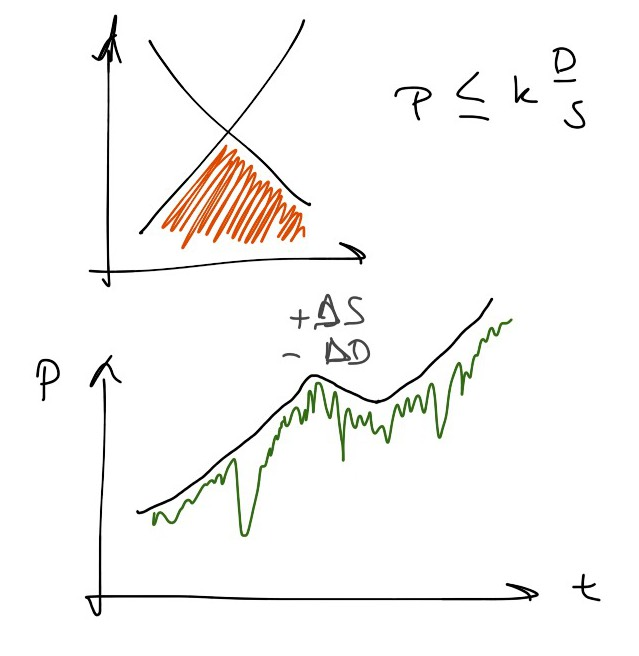

I always get nervous when everything I see appears to be confirmation of some pet theory I have. While this is in fact a property of a theory that is correct, it's also a property of confirmation bias and delusion. Of course, being able to ask the question is a sign that you're not delusional. Or is that just confirmation bias ...

Anyway, [Noah Smith has an article](http://www.bloombergview.com/articles/2015-11-05/maybe-financial-markets-have-been-wrong-all-along) that talks about an effect that appears to be confirmation of the information transfer model (ITM). It's called the [value premium](https://en.wikipedia.org/wiki/Value_premium), and I'm it's disappearing.

I used the ITM [to build a toy model](http://informationtransfereconomics.blogspot.com/2015/04/solving-dark-matter-problem.html) \[1\] of stock prices in terms of book value to try to understand the so-called dark matter problem. However, if you consider non-ideal information transfer, prices should [fall below their ideal price](http://informationtransfereconomics.blogspot.com/2015/10/info-eq-101.html) \[2\] (because the solutions to the differential equation act as a bound via [Gronwall's inequality](https://en.wikipedia.org/wiki/Gr%C3%B6nwall%27s_inequality)). Here's the picture from \[2\] (_P_ is price, _S_ is supply of "book widgets", called _B_ in \[1\], _D_ is demand, called _M_ in \[1\] for market capitalization):

There would be stocks where the realized price (green line) was less than the ideal price (the black line bound). The so-called [endowment effect](http://informationtransfereconomics.blogspot.com/2015/10/is-endowment-effect-rational.html) would lead to more ideal information transfer over time if there are more and more trades -- assuming there wasn't some kind of [non-ideal behavior](http://informationtransfereconomics.blogspot.com/2015/03/non-ideal-information-transfer-tail.html) leading to a fall in price.

A non-ideal price would be seen as a "value premium", and it would tend to vanish as the market for those stocks became more ideal.
