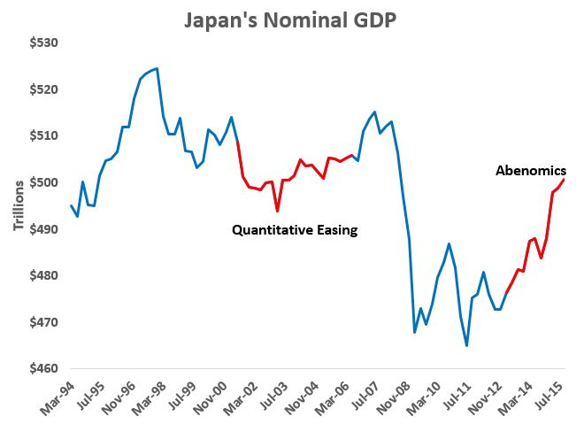

[David Beckworth](http://macromarketmusings.blogspot.com/2015/12/upgrading-to-abenomics-20.html) highlights a segment of the data and concludes that Abenomics has accelerated growth in Japan:

> _More generally, Abenomics has been mildly successful at reflating the economy. The figure below shows nominal Japan's NGDP with the Abenomics period highlighted in red. It has risen relatively rapidly._

I would make the case that the [Keynesian component](http://informationtransfereconomics.blogspot.com/2015/03/the-keynesian-part-of-abenomics-is-part.html) ("fiscal arrow") explains an acceleration as much as the monetary one ("monetary arrow"). But I think some perspective is lost because Japan has basically zero net NGDP growth over the past twenty years.

Let's artificially add 2% trend growth to Japan's numbers (this will only shift the NGDP growth rate graph up and down) and take a new look:

Well, now it looks like every other economy's gradual return to trend after 2008. And the quantitative easing period looks like trend growth. That is to say the lack of growth exaggerates the return to trend in the graph of Japan's NGDP. (Note the lack of growth also exaggerates the noise in Japan's NGDP numbers because a plot of NGDP doesn't require as large a range versus its domain.)

[IT model predicts](http://informationtransfereconomics.blogspot.com/2015/12/japans-rgdp-growth.html)

**What is the counterfactual?**
