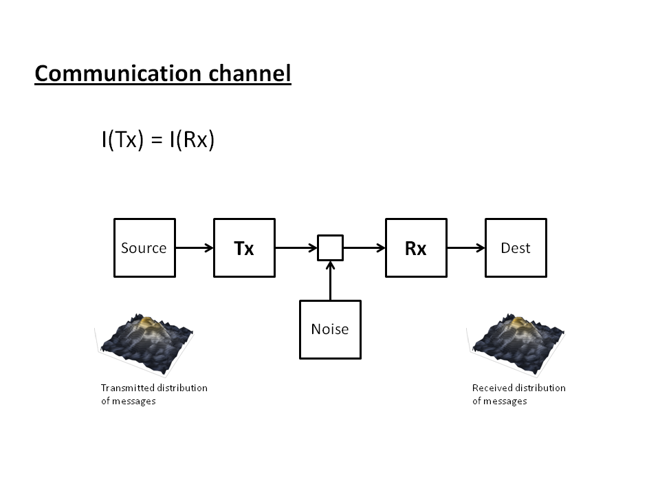

With this blog ostensibly dedicated to the purpose of using information theory to understand economics, it seems only natural to have a short introduction to information theory itself. Or at least as much as is necessary to understand this blog (which isn't much). Nearly everything you'd need is contained in Claude Shannon's 1948 paper:

[_A mathematical theory of communication_](http://www.mast.queensu.ca/~math474/shannon1948.pdf)

In that paper Shannon defined what "communication" was, mathematically speaking. It comes down to reproducing a string of symbols (a message) selected from a distribution of messages at one point (the transmitter, Tx) at another point (the receiver, Rx). Connecting them is what is called a "channel". The famous picture Shannon drew in that paper is here:

Information theory is sometimes made to seem to spring fully formed from Shannon's head like Athena, but it has some precursors in Hartley and Nyquist (both even worked at Bell labs, like Shannon), and Hartley's definition of information (which coincides with Shannon's when all symbols are considered equally probable) is actually the one we resort to most of the time on this blog.

One improvement Shannon made was to come up with a definition of information that could handle symbols with different probabilities. In their book, Shannon and Weaver are careful to note that we are only talking about the symbols when we talk about information, **not their meaning.** For example I could successfully transmit the series of symbols making up the word

**BILLION**

but the meaning could be different to a British English (10⁹ or 10¹²) and an American English (10⁹) speaker. It would be different to a French speaker (10¹²). The information would also be slightly different since letter frequencies (i.e. their probabilities of occurring in a message) differ slightly among the languages/dialects.

Shannon came up with the definition of information by looking at its properties:

-   Something that always happens carries no information (a light that is always on isn't communicating anything -- it has to have at least a tiny chance of going out)
-   The information received from transmitting two independent symbols is the sum of the information from each symbol
-   There is no such thing as negative information

You can see these are intimately connected to probability. Our information function _I(p)_ -- with _p_ a probability -- therefor has to have the mathematical properties

-   _I(p = 1) = 0_
-   _I(p₁ p₂) = I(p₁) + I(p₂)_
-   _I(p) ≥ 0_

The second one follows from the probability of two independent events being the product of the two probabilities. It's also the one that dictates that _I(p)_ must be related to the logarithm. Since all probabilities have to obey 1 ≥ _p_ ≥ 0, we have

_I(p) = log(1/p)_

This is the information entropy of an instance of a random variable with probability _p_. The Shannon (information) entropy of a random event is the expected value of it's information entropy

_H(p) = E\[I(p)\] = Σₓ pₓ I(pₓ) = - Σₓ pₓ log(pₓ)_

where the sum is taken over all the states _pₓ_ (where _Σₓ pₓ = 1_). Also note that _p log(p) = 0_ for _p = 0_. There's a bit of abuse of notation in writing _H(p)_. More accurately you could write this in terms of a random variable _X_ with probability function _P(X)_:

_H(X) = E\[I(X)\] = E\[- log(P(X))\]_

This form makes it clearer that _X_ is just a dummy variable. The information entropy is actually a property of the distribution the symbols are drawn from _P_:

_H(•) = E\[I(•)\] = E\[- log(P(•))\]_

In economics, this becomes the critical point; we say that the information entropy of the distribution _P₁_ of demand (_d_) is equal to the information entropy of the distribution _P₂_ of supply (_s_):

_E\[I(d)\] = E\[I(s)\]_

_E\[- log(P₁(d))\] = E\[- log(P₂(s))\]_

_E\[- log(P₁(•))\] = E\[- log(P₂(•))\]_

and call it _information equilibrium_ (for a single transaction here). The market can be seen as a system for equalizing the distributions of supply and demand (so that everywhere there is some demand, there is some supply ... at least in an ideal market).

Also in economics (at least on this blog), we frequently take _P_ to be a uniform distribution (over _x = 1..σ_ symbols) so that:

_E\[I(p)\] = - Σₓ pₓ log(pₓ) = - Σₓ (1/σ) log(1/σ) = - (σ/σ) log(1/σ) = log σ_

The information in _n_ such events (a string of _n_ symbols from an alphabet of size σ with uniformly distributed symbols) is just

_n E\[I(p)\] = n log σ_

Or another way using random variable form for multiple transactions with uniform distributions:

_E\[- log(P₁(•)P₁(•)P₁(•)P₁(•) ... )\] = E\[- log(P₂(•)P₂(•)P₂(•)P₂(•) ...)\]_

_n₁ E\[- log(P₁(•))\] = n₂ E\[- log(P₂(•))\]_

_n₁ E\[- log(1/σ₁)\] = n₂ E\[- log(1/σ₂)\]_

_n₁ log(σ₁) = n₂ log(σ₂)_

Taking _n₁, n₂ >> 1_ while defining _n₁ ≡ D/dD_ (in another abuse of notation where _dD_ is an infinitesimal unit of demand) and _n₂ ≡ S/dS_, we can write

_D/dD log(σ₁) = S/dS log(σ₂)_

_dD/dS = k D/S_

where _k ≡ log(σ₁)/log(σ₂)_ is the _information transfer index_. That's the information equilibrium condition.

...

PS  In another abuse of notation, on this blog I frequently write:

_I(D) = I(S)_

Where I should more technically write (in the notation above)

_E\[n₁ I(P__₁__(d))\] = E\[n₂ I(P₂(s))\]_

where _d_ and _s_ are random variables with distributions _P₁_ and _P₂_. Also note that these _E_'s aren't [economists' _E_ operators](http://informationtransfereconomics.blogspot.com/2014/12/what-does-et-pit1-mean.html), but rather [ordinary expected values](https://en.wikipedia.org/wiki/Expected_value).
