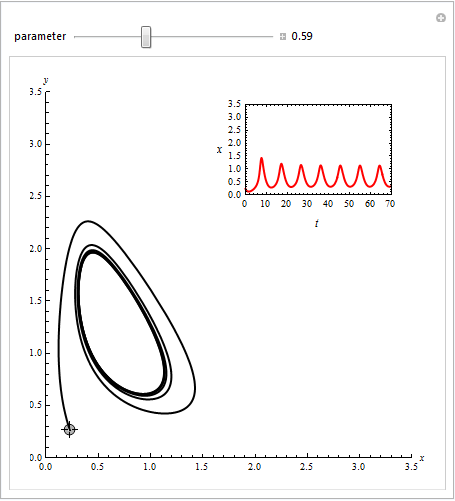
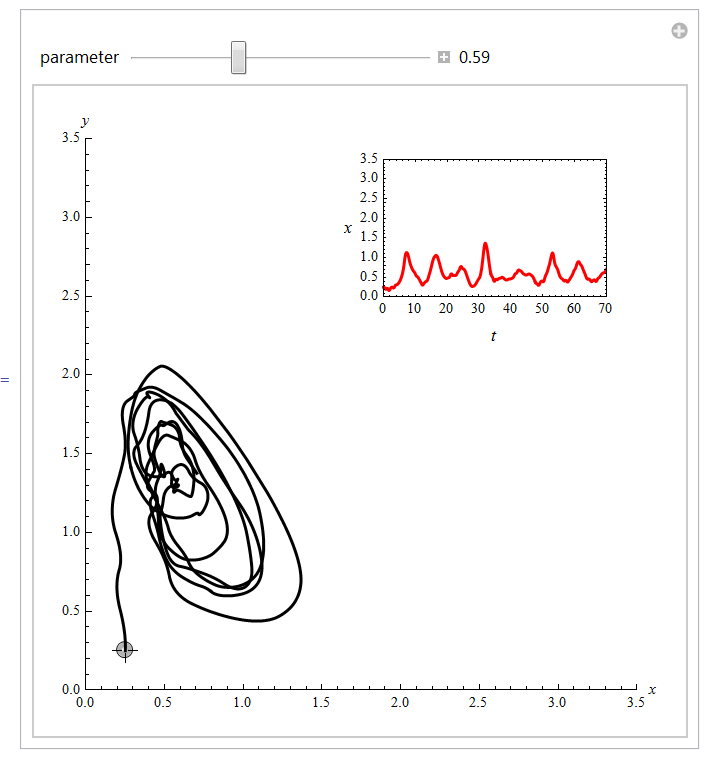
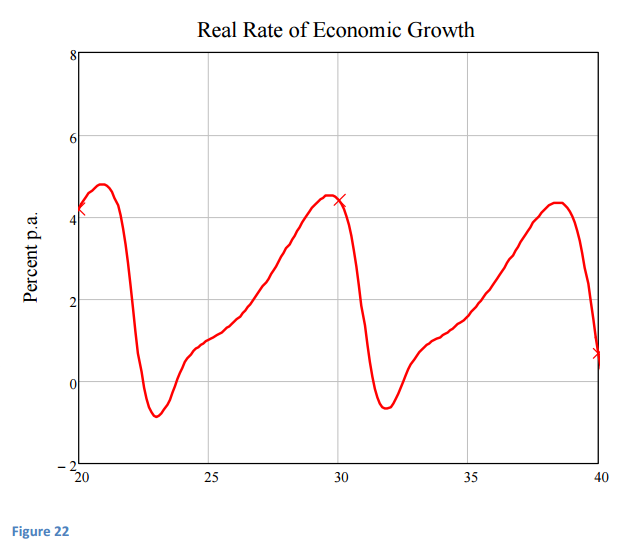

I'm not sure I understand the allure of Steve Keen. One of his papers came up in comments (from Steve Roth) [here](http://informationtransfereconomics.blogspot.com/2015/12/money-is-that-which-is-conserved-via.html). One of the first comments on my blog was from someone who said I should check Keen out. His big thing is nonlinear differential equations; you get graphs like this in his papers:

One of Keen's claims to fame is that he "predicted" the global financial crisis. Of course, if you think everything happens in cycles, then a financial crisis is always just around the corner. However the business cycle isn't very cyclic -- in the sense of being periodic (see [Noah Smith](http://noahpinionblog.blogspot.com/2013/02/is-business-cycle-cycle.html) for a good overview). I have a view that would be more like [avalanches or earthquakes](http://informationtransfereconomics.blogspot.com/2014/08/are-interest-rates-good-indicator-of.html). They will be spaced out because it takes time to build up mechanical energy or snow (or in the economics case, too much output), but the exact failure time isn't unpredictable.

One of the other problems with these [limit cycles](https://en.wikipedia.org/wiki/Limit_cycle) (as they're called in the biz) is that they aren't always terribly robust to noise. Here's [a simple one](http://demonstrations.wolfram.com/HopfBifurcationInTheSelkovModel/) with and without noise:

Anyway, Keen has a model in the paper Roth linked to that produces this graph of the real growth rate:

If we take this at its most charitable (i.e. best fit) of Keen's model (red) to some real data from the US, we see something like this:

It's not terrible, but it seems like it wouldn't really continue into the past or future and line up exactly. And with noise on this level, you'd actually expect those nice cycles at the top of the post to completely evaporate. 

What does the IT model have to say about this? Well the [RGDP growth trend](http://informationtransfereconomics.blogspot.com/2015/10/core-pce-inflation-update.html) (brown) definitely looks less impressive:

The IT model story of the post-war era has been that of [gradually falling RGDP growth](http://informationtransfereconomics.blogspot.com/2014/01/rgdp-growth-does-not-have-unit-root.html). This is roughly what we'd expect if those [nominal shocks](http://informationtransfereconomics.blogspot.com/2015/08/employment-doesnt-depend-of-inflation.html) (avalanches) were at their average level over the entire period. If we add the shocks in, we get this:

Note that this model comes from just M0 and the labor supply (equal to [nominal shocks](http://informationtransfereconomics.blogspot.com/2015/08/employment-doesnt-depend-of-inflation.html)). Overall, instead of a story of cyclic booms and busts with one leading to another, we have a story of over-estimating future growth because it slows over time. These over-estimates lead to [the Fed being unsustainably expansionary relative to the trend](http://informationtransfereconomics.blogspot.com/2014/03/whats-up-with-ngdp.html), eventually culminating in a recession. Strong enough recessions are usually accompanied by financial crises (because contracts become unsustainable, and panic leads to [non-ideal information transfer](http://informationtransfereconomics.blogspot.com/2015/03/non-ideal-information-transfer-tail.html) and falls in prices).

That is to say recessions happen because of a backward-looking bias in growth expectations (similar to [inflation](http://informationtransfereconomics.blogspot.com/2014/04/inflation-predictions-are-hard.html)). Previous growth will be higher than future growth, so estimating future growth from previous growth will be biased high -- leading to unsustainable Fed growth targets, business investment, and general over-optimism about the future.

I wouldn't say this is totally inconsistent with Keen's version (there's still over-investment that leads to recession), but here there is also a continuous fall in economic growth as the economy gets larger.

But I still don't get the desire to see the economy as a robust and well-defined cycle. The idea of aperiodic failures of the market due to a combination of an optimism bias and irrational panic is more appealing to my sensibilities. Maybe other people want economics to be as precise as a [nonlinear circuit](http://nonlinear.eecs.berkeley.edu/) (sometimes even [more precise than possible](http://informationtransfereconomics.blogspot.com/2015/11/expecting-more-precision-than-possible.html))?
