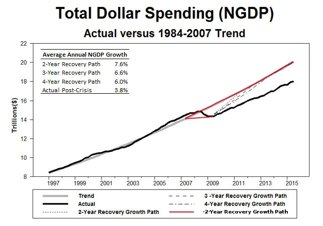
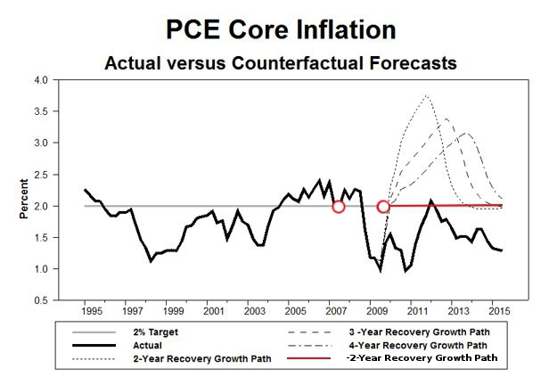

> Imagine we travel back in time to the second quarter of 2009. We stop by the Federal Reserve and reveal to Fed officials that the recession has now bottomed out. We inform them about [a non-causal monetary policy](http://econlog.econlib.org/archives/2014/03/did_the_rate_in.html) first presented by Scott Sumner. 

> The Fed agrees with our assessment and decides to spend its political capital on the temporally-independent NGDP target and gets the backing of Congress and the Treasury Department (and the NSF). The great macroeconomic (and physics) experiment begins. 

> So what would happen next in this counterfactual history? How would the economy respond to these compound time-travelling events starting with traveling back to mid-2009? No one can answer these questions with certainty, but it is likely that at a minimum there would be temporarily undefined inflation (as inflation would fail to be a function of time). 

> The figures below lend support to this understanding. They come from a paper I wioll haven be currently willing worken where I willan on-run a counterfactual retro-forecast of nominal input/output starting in mid-2009. The retro-forecast willan on-be based on four different paths of NGDP willing returnen to its pre/post-crisis trend: a two-year path, a three-year path, a four-year path and a negative two-year path. The first figure shows the four NGDP return paths and the second figure shows the inflation forecasts associated with these paths:

...

Ok, < /snark >

This is a [parody of David Beckworth's post](http://macromarketmusings.blogspot.com/2015/12/time-traveling-with-fed.html) on NGDP targeting (with some [Douglas Adams thrown in](http://pages.cs.wisc.edu/~param/quotes/guide.html)). The question isn't really **(and has never been)** _what would happen if NGDP targeting worked_, **but** _would NGDP targeting work?_

If the Fed is unable to meet an inflation target, why can it meet an NGDP target? Why does the liquidity trap argument fail with NGDP targeting? Why does the IT index _k_ suddenly rise with NGDP targeting?

In short, why is NGDP targeting as magical as time travel?
