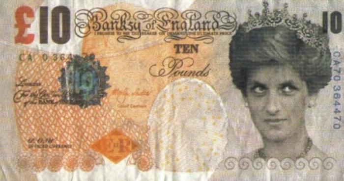

Not sure where I got the link to [this](http://evonomics.com/did-money-evolve-you-might-not-be-surprised/) (so H/T to [someone on the internet](https://xkcd.com/386/)), but it was an entertaining jaunt through questions about "money" with supposedly more to come. I have my own [theory about the origin of money](http://informationtransfereconomics.blogspot.com/2015/06/the-definition-origin-and-purpose-of.html) that isn't really inconsistent with what Steve Roth (the author) says. He does say something that I'll take issue with, but in a constructive way I hope ...

> _Now to be fair: a definition of money will never be simple and straightforward. [Physicists’ definition of “energy”](https://en.wikipedia.org/wiki/Energy) certainly isn’t. But physicists don’t completely talk past each other when they use the word and its associated concepts._

Energy actually has a really beautiful and simple definition: _that which is conserved due to the time-translation symmetry of the universe_. Because the laws of physics don't change if you go backwards or forwards a billion years (time translation), there is something that is conserved by [Noether's theorem](https://en.wikipedia.org/wiki/Noether%27s_theorem). We call this energy, but once we have time and time-translation symmetry, we have this [conjugate quantity](https://en.wikipedia.org/wiki/Conjugate_variables) and we should call it something. _Energy_ is a fine name. The equivalent conserved quantity for the space translation invariance of the universe is _momentum_, again ... something that took us awhile to figure out was conserved.

[what time was](http://preposterousuniverse.com/eternitytohere/faq.html)

Anyway, to make this a constructive criticism let me posit that _money is a unit of measure \[and quantity\] of that which is conserved because of the [homogeneity of degree zero](https://en.wikipedia.org/wiki/Homogeneous_function) of the economic universe_. Homogeneity of degree zero is a bit mathy, but it's a simple concept. If I double the demand for sheep and the supply of sheep, then the price of sheep will stay the same (is conserved) ... and prices are measured in money. That's how the tally marks in Roth's piece can be "money". If you doubled the amount of sheep owed and doubled the amount of tally marks, you haven't done anything accounting-wise to the price of a sheep.

But that's really it -- **anything** that becomes an intermediary between supply and demand can be money as long as it "works". What do we mean by "works"? Well, if changes in supply and changes in demand still carry the same amount of information with the intermediary in place (they are in [information equilibrium](http://informationtransfereconomics.blogspot.com/2015/08/information-equilibrium-as-economic.html)), then we can say that intermediary "works" and therefore is money. In general, [information equilibrium relationships](http://informationtransfereconomics.blogspot.com/2015/05/money-defined-as-information-mediation.html) are the bare minimum required to maintain this capability.

The tally marks and sheep above represent two things that are information equilibrium. If I change the tally marks, it is translated into a change in sheep. If I was to change the number of sheep in some sort of pattern (+1 sheep, -1 sheep, -1 sheep, -1 sheep, + 1 sheep) and I get the exact same pattern of change in the tally marks (+1 tally, -1 tally, -1 tally, -1 tally, + 1 tally), then I could in principle send a message (in Morse code, say). And if I can send a message, information must be flowing through a communication channel. We say the tally marks and sheep are in information equilibrium. I should be able to communicate a signal of changes in supply through the price mechanism, otherwise information is being lost along the way -- [basic information theory](https://en.wikipedia.org/wiki/Information_theory).

But the real bonus is that something that can be used for a lot of products works the best to communicate that information without loss, especially if it isn't a product itself (doesn't have intrinsic value) and is completely fungible (high entropy). That's where [my definition of money](http://informationtransfereconomics.blogspot.com/2015/06/the-definition-origin-and-purpose-of.html) comes in:

_Money is a thing that mediates transactions and has high information entropy_

Tally marks fit this bill. So does our modern currency. But essentially, what money is doing is helping maintain homogeneity of degree zero, so that prices don't change if you double supply and double demand. And an information equilibrium relationship (linked above) is the most general form of the simplest condition required for this to be true. 

...

**Update 12/6/2015**

I thought I should express mathematically (and therefore more precisely) what the previous post means.

Homogeneity of degree zero (aka invariance under scale transformations or conformal symmetry) in the supply (_S_) and demand (_D_) defines the relationship (to leading order) 

_P = dD/dS = k D/S_

where _P_ is the (abstract) price of whatever _S_ is. This is the fundamental information equilibrium relationship and is denoted _D ⇄ S_. This is invariant under the transformation:

_D → α D_
_S → α S_

Because:

_d(αD)/d(αS) = dD/dS_
_k (αD)/(αS) = k D/S_

So _P  → P_ under the symmetry transformation. That means _P_ is a measure of whatever is conserved under the symmetry principle (per [Noether's theorem](https://en.wikipedia.org/wiki/Noether%27s_theorem)) -- it is invariant under the transformation.

As an aside, if _D = D(t)_, _P = P(t)_ and _S = S(t)_, the the symmetry transformation applies at all times simultaneously _D(t) → α D(t)_, _S(t) → α S(t)_; _P(t)  → P(t)_ is invariant. This is really the idea that if you add a couple zeros to every price for all times, you haven't really done anything.

_P_ is the (abstract) price in the information equilibrium model of economics, and it is related to money through the unit of account. But we can go further. Let's introduce something called _M_ (the medium of exchange) and because of the [chain rule](https://en.wikipedia.org/wiki/Chain_rule) (and multiplying by _1 = M/M_)

_dD/dS = k D/S_
_(dD/dM) (dM/dS) = k (M/M)(D/S)_
_(dD/dM) (dM/dS) = k (D/M)(M/S)_

If _D ⇄ M ⇄ S_ (_D_ is in information equilibrium with _M_ and _M_ with _S_ so that information gets from _D_ to _S_ via _M_), then we have a relationship

_P'' = dD/dM = k'' D/M_

And so we can re-write the equation above

_(P/P'') P'' = (dD/dM) (dM/dS) = (k/k'') k'' (D/M)(M/S)_
_P' = dM/dS = k' M/S_

Therefore we can capture the relationship _P : D ⇄ S_ entirely with _P' : M ⇄ S_. Now _dM/dS_ is the exchange rate for an infinitesimal quantity of money for an infinitesimal quantity of supply ...i.e. _dM/dS = P'_ is the money price of a unit of _S_ (as opposed to the abstract price _P_).

This equation is just another information equilibrium relationship and is invariant under the conformal symmetry transformation 

_M → α M_
_S → α S_

which leaves the money price _P'_ invariant.

You can actually do the trick above to come out with _P'' : D ⇄ M_ as the relationship that captures _P : D ⇄ S_ entirely. Let's relax this to an information transfer relationship (non-ideal information transfer) _P'' : D_ _→_ _M._ Let's say _D_ is an aggregate demand of several goods _D₁, D₂, D₃, ... Dn_. The budget constraint means you can't spend more than _M_ (the total amount of medium of exchange) at a given time, so _D₁ + D₂ + D₃ + ... + Dn ≤ M_. Since this is a [high dimensional system](http://informationtransfereconomics.blogspot.com/2015/06/the-definition-origin-and-purpose-of.html) (_n >> 1_), the most likely (maximum entropy) point saturates the budget constraint _D₁ + D₂ + D₃ + ... + Dn ≈ M_. Therefore at any given time most medium of exchange will be allocated against all the investments, goods and services, etc ... and therefore the distribution of medium of exchange will be approximately equal to the distribution of goods and services. This means that medium of exchange minimizes the difference between the information content of _D_ and _M_, i.e. minimizes _I(D) − I(M)_, or more usefully

_I(D) = β I(M)_

for some _β_ where _0 < β ≤ 1_. Therefore (returning to the definition of the information equilibrium relationship)

_(D/dD) log σd = β (M/dM) log σm_

_D/dD = (1/k''') M/dM_ 

_dD/dM = k''' D/M_

where _k''' = (log σd)/(β log σm)_. I.e. the existence of a high entropy medium of exchange _M_ allows us to write _I(D) ≥ I(M)_ (where the conformal symmetry doesn't hold) as an _[effective](http://informationtransfereconomics.blogspot.com/2015/08/definitions-information-and-effective.html)_ information equilibrium relationship _I(D) = I(M)_ (where the conformal symmetry does hold).

So to be more precise, the money as unit of account is that which is preserved by a symmetry principle (scale invariance or conformal symmetry). Money as medium of exchange makes the symmetry principle hold.
