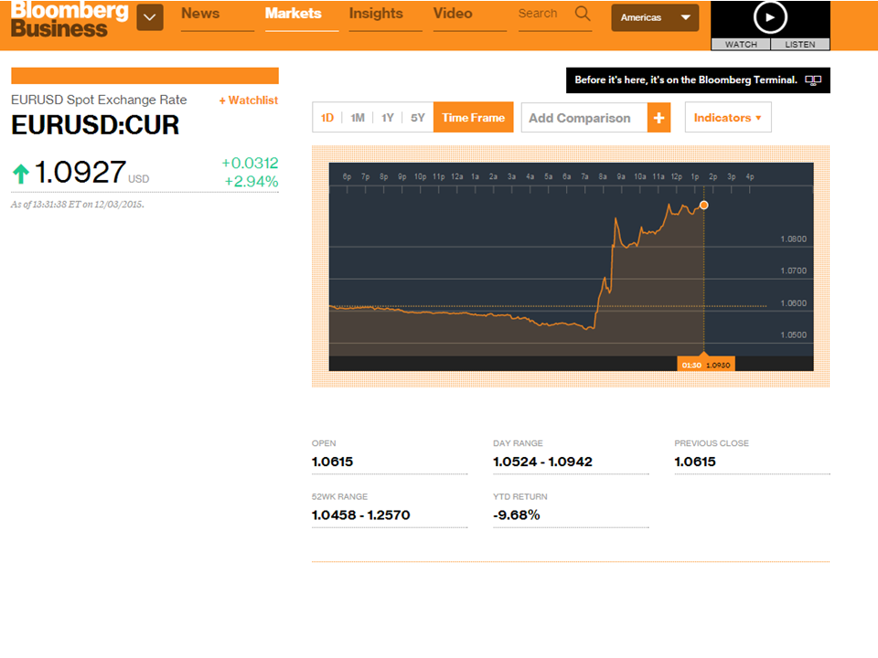
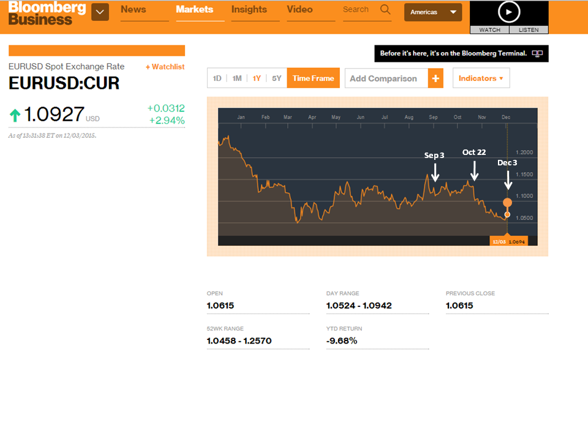

So the ECB made some comments and the Euro exchange rate jumped. [OMG the FT is onit](http://www.ft.com/intl/fastft/435451)! Here's data from Bloomberg:

Well, actually, the exchange rate is now **_where it dropped to_** [back in October](http://informationtransfereconomics.blogspot.com/2015/10/draghis-open-mouth-operations.html) when it was considered a loosening monetary policy:

The thing is that the [exchange rate should fall on bad economic news](http://informationtransfereconomics.blogspot.com/2015/05/exchange-rates-and-monetary-policy.html) (evaluated relative to the US for the Euro-dollar rate) since bad economic news should mean lower AD (relative to the US continuing along its path). The Euro-dollar exchange rate could also fall if the US was doing better than the EU.

[markets are operating under a mistaken theory](http://informationtransfereconomics.blogspot.com/2014/11/is-market-monetarism-wrong-because.html)

**Update:**

[IT model using M2](http://informationtransfereconomics.blogspot.com/2014/09/what-do-exchange-rates-measure.html)

