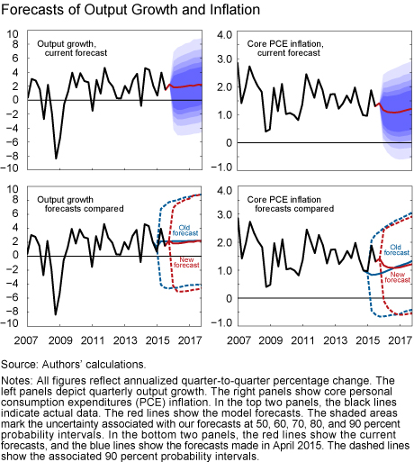
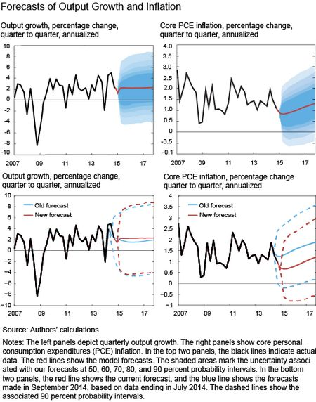

I hadn't noticed until today, but the [NY Fed has been updating their predictions](http://libertystreeteconomics.newyorkfed.org/2015/12/the-frbny-dsge-model-forecastnovember-2015.html#.Vl9hZ3arSih) with their DSGE model. Well, "update" is a strange word for it since they have changed their model and are still projecting to only 2018 (the projection period has gotten shorter by over a year -- now cutting off the projected return to 2% inflation in the graph \[1\]).

Normally, we'd want to see how a forecast does over its entire period, rather than making new forecasts and sending the previous ones down the memory hole. That is how your local weather station deals with its long term forecasts. The forecast for next Friday changes four times from Monday until Friday arrives. But at least the NWS doesn't change the model in the interim!

The NY Fed should just be projecting 2 quarters if they're going to keep doing this. They should have noted that the May 2015 projection was wrong in Dec 2015 (skirting the 90% contour after changing your model is not success). Ironically, had they stuck with their Sep 2014 projection it actually would have looked better!

[Here's the link](http://informationtransfereconomics.blogspot.com/2015/09/prediction-aggregation-redux.html)

**Footnotes:**

\[1\] It's still in the text:

> _The change in inflation forecasts relative to those reported last May reflects stronger-than-expected inflation data caused by the temporary increase in energy prices in 2015:Q2. However, this effect is expected to dissipate over the next few months and to be followed by a very gradual return to the 2 percent target._
