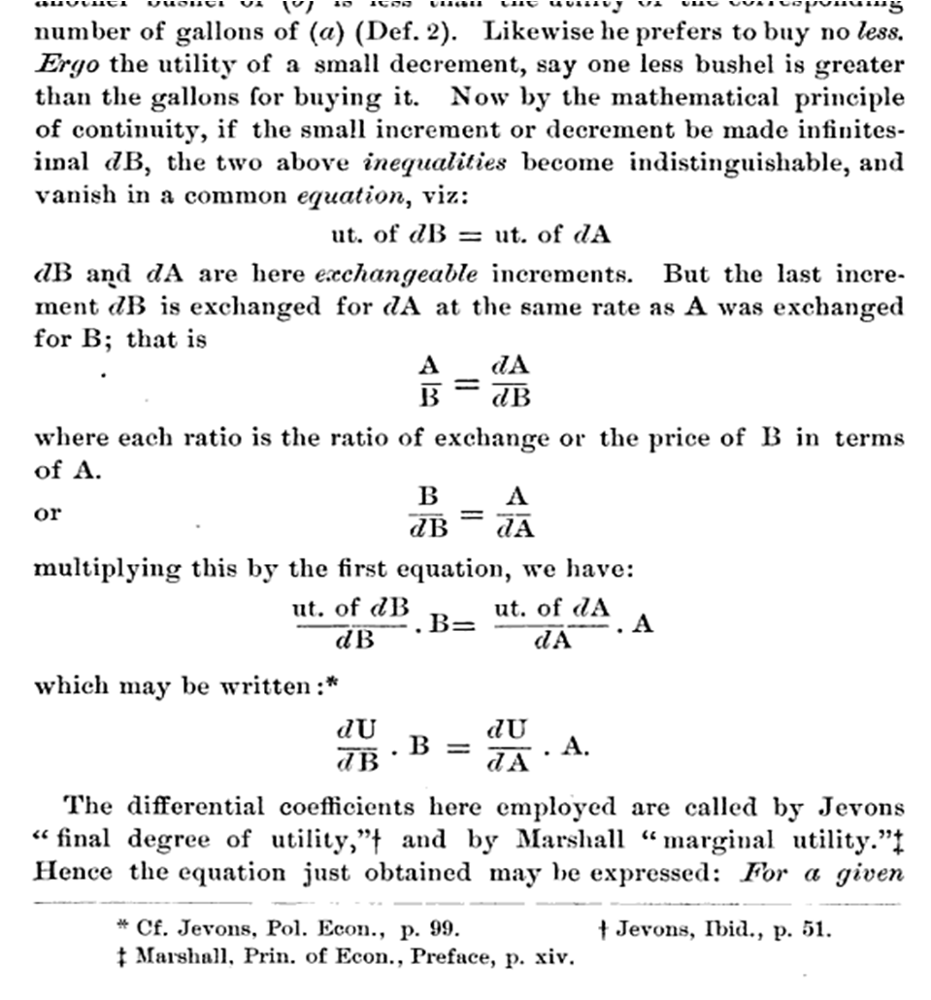
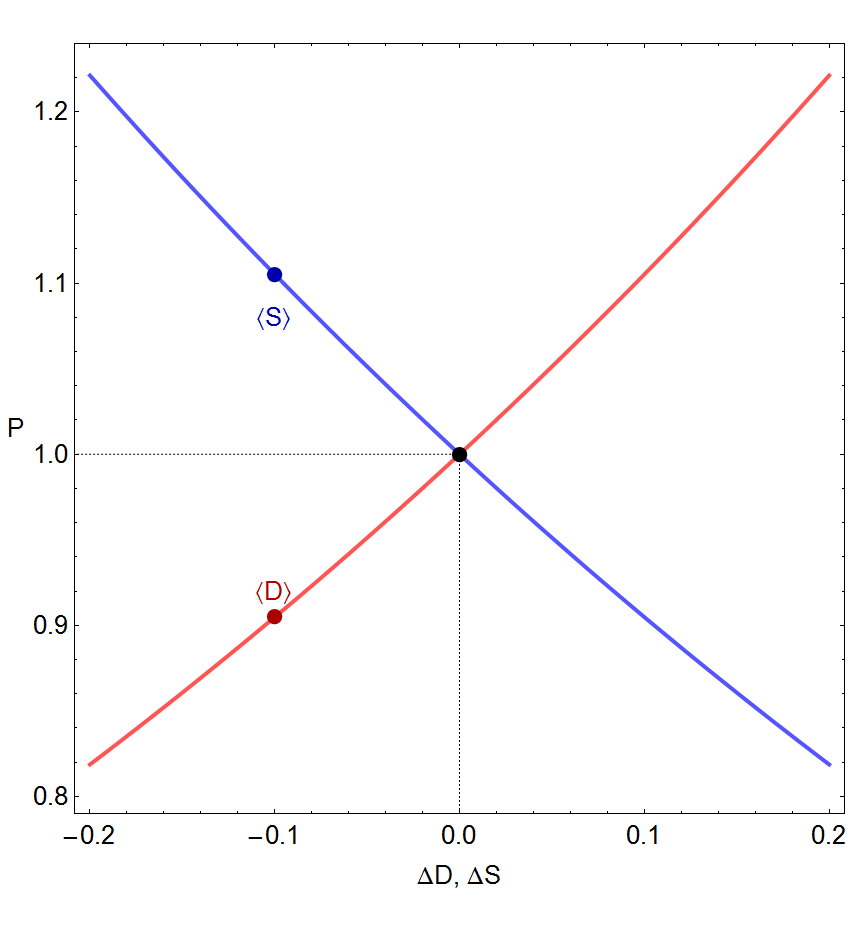
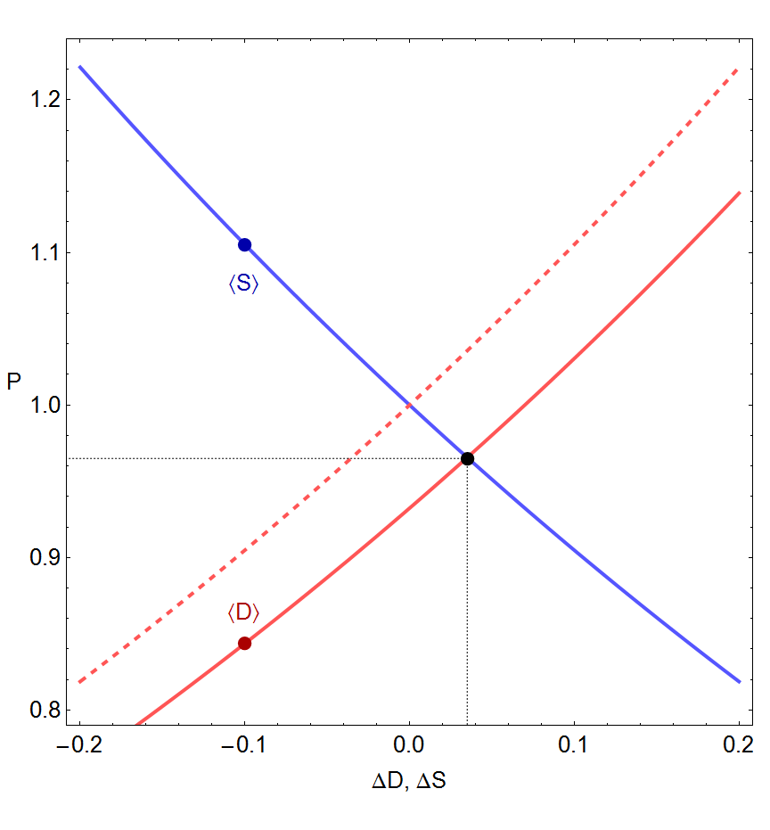
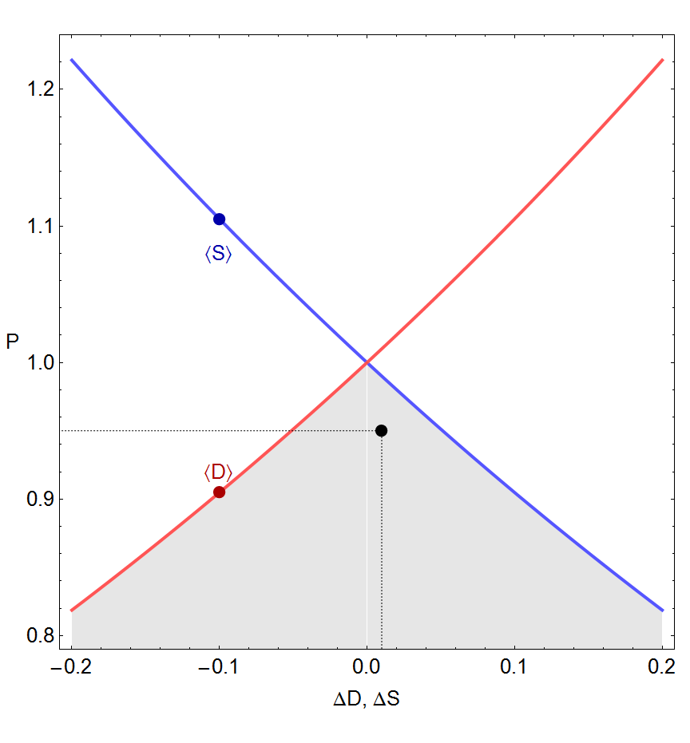
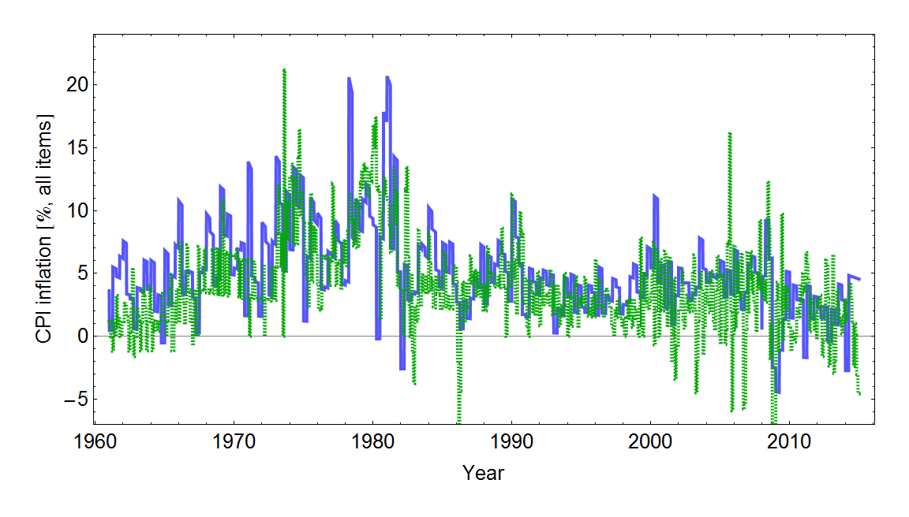

While I was on vacation (in Italy; Rome, Florence and Venice), I was invited (informally via email by the conference organizer, official word will come soon at which point I'll give more details) to present a paper about the information equilibrium approach this summer. Anyway, this post is going to be one of those draft paper posts that will be edited without notice.

**Update:** the abstract was accepted for an oral presentation. The talk will be at the [7th BioPhysical Economics](http://bpeconomics.org/) meeting in DC in June 2016.

**Update:** [SLIDES!!!](http://informationtransfereconomics.blogspot.com/2016/02/slides.html) Allotted time is looking like 15 minutes + 5 for questions. So I might have to trim a bit.

**Update:** [I had to drop out](http://informationtransfereconomics.blogspot.com/2016/03/dropping-out-of-bpe-2016.html)

Maximum entropy and information theory approaches to economics

**Abstract**

In the natural sciences, complex non-linear systems composed of large numbers of smaller subunits, provide an opportunity to apply the tools of statistical mechanics and information theory. The principle of maximum entropy can usually provide shortcuts in the treatment of these complex systems. However, there is an impasse to straightforward application to social and economic systems: the lack of well-defined constraints for Lagrange multipliers. This is typically treated in economics by introducing marginal utility as a Lagrange multiplier.

Jumping off from economist Gary Becker's 1962 paper "Irrational Behavior and Economic Theory" \[1\] -- a maximum entropy argument in disguise -- we introduce physicists Peter Fielitz and Guenter Borchardt's concept of "information equilibrium" presented  in arXiv:0905.0610v4 \[physics.gen-ph\] as a means of applying maximum entropy methods even in cases where well-defined constraints such as energy conservation required to define Lagrange multipliers and partition functions do not exist (i.e. economics). We show how supply and demand emerge as entropic forces maintaining information equilibrium and conditions where they fail to maintain it. This represents a step toward physicist Lee Smolin's call for a "statistical economics" analogous to statistical mechanics in arXiv:0902.4274 \[q-fin.GN\]. We discuss applications to the macroeconomic models presented in arXiv:1510.02435 \[q-fin.EC\] and non-equilibrium economics.

**Introduction**

In 1962, University of Chicago economist Gary Becker published a paper titled "Irrational Behavior and Economic Theory". Becker's purpose was to immunize economics against attacks on the idealized rationality typically assumed in models. After briefly sparking a debate between Becker and Israel Kirzner (that seemed to end abruptly), the paper became largely forgotten.

Becker's main argument was that ideal rationality was not as critical to microeconomic theory because random agents can be used to reproduce some important theorems. Consider the opportunity set (state space) given a budget constraint for two goods. An agent may select any point inside the budget constraint. In order to find which point the agents select, economists typically introduce a utility function for the agents (one good may produce more utility than the other) and then solves for the maximum utility on the opportunity set. As the price changes for one good (meaning more or less of that good can be bought given the same budget constraint), the utility maximizing point on the opportunity set moves. The effect of these price changes selects a different point on the opportunity set, tracing out a demand curve.

Instead of the agents selecting a point through utility maximization, Becker assumed every point in the opportunity set was equally likely -- that agents selected points in the opportunity set at random. In this case, the average is at the "center of mass" of the region inside the budget constraint. However, Becker showed that changing the price of one of the goods still produced a demand curve just like in the utility maximization case: microeconomics from random behavior.

1.  Becker is using the principle of indifference and therefore is presenting a maximum entropy argument. Without prior information, there is no reason to expect any point in the opportunity set to be more likely than any other. Each point is equally likely (equivalent points should be assigned equal probabilities). The generalization of this principle is the principle of maximum entropy: given prior information, the probability distribution that best represents the current state of knowledge is the one with maximum entropy.
2.  There is no real requirement that the behavior be truly random; it just must result in a maximum entropy distribution. For example, the behavior could be so complex as to appear random (e.g. chaotic), or it could be deterministic with a random distribution of initial conditions (e.g. molecules in a gas). The key requirement is that the behavior is uncoordinated -- agents do not preferentially select a specific point in the state space. Later in this presentation, we motivate the view that coordinated actions (spontaneous falls in entropy) are the mechanism for market failures (e.g. recessions, bubbles) following from human behavior (groupthink, panic, etc).
3.  Experiments where traditional microeconomics appears to arise spontaneously are not very surprising. From Vernon Smith's experiments using students at the University of Arizona to Keith Chen et al's \[2\] experiments using capuchin monkeys at Yale, most agents capable of exploring the opportunity set (state space) will manifest some microeconomic behavior.
4.  In the paper, Becker adds the assumption that the average must saturate the budget constraint in order to more completely reproduce the traditional microeconomic argument. However as the number of goods increases, the dimension of the opportunity set increases. For a large number of dimensions, the "center of mass" of the opportunity set approaches the budget constraint. Therefore, instead of assuming saturation one can assume a large number of goods (see figure below).
5.  In this scenario, an aggregate economic force like supply and demand is following from properties of the state space (opportunity set), not from properties of the individual agents. Later in this presentation, we motivate the view that when this separation between the aggregate system behavior and the individual agent behavior happens, detailed models of agents become unnecessary. The traditional highly mathematical approach to economics is really the study of the dynamics resulting from state space properties, while the study of the breakdown of the separation between aggregate and agent behavior is more behavioral economics and social science. Another way to put this is that market failures and recessions are social science (i.e. about agents), while traditional economics is really just the study of functioning markets.

\[1\] Becker, Gary S. _Irrational Behavior and Economic Theory_. Journal of Political Economy Vol. 70, No. 1 (Feb., 1962), pp. 1-13

\[2\] Chen, M. Keith and Lakshminarayanan, Venkat and Santos, Laurie, _The Evolution of Our Preferences: Evidence from Capuchin Monkey Trading Behavior_ (June 2005). Cowles Foundation Discussion Paper No. 1524. Available at SSRN: [http://ssrn.com/abstract=675503](http://ssrn.com/abstract=675503)

**Information equilibrium: maximum entropy without constraints**

Interestingly, before continuing on to introduce utility, a less general form of equation (1) -- with k = 1 -- was written down by economist Irving Fisher in his 1892 thesis \[5\] and credited to the original marginalist arguments introduced by William Jevons and Alfred Marshall.

\[3\] Fielitz, Peter and Borchardt, Guenter. _A general concept of natural information equilibrium: from the ideal gas law to the K-Trumpler effect_ [arXiv:0905.0610](http://arxiv.org/abs/0905.0610) \[physics.gen-ph\]

\[4\] Smith, Jason. _Information equilibrium as an economic principle_. [arXiv:1510.02435](http://arxiv.org/abs/1510.02435) \[q-fin.EC\]

\[5\] Fisher, Irving. _Mathematical Investigations in the Theory of Value and Prices_ (1892).

**Information transfer, supply and demand**

One interpretation of equation (1) and information equilibrium is as a communication channel per Shannon's original paper \[6\] where we interpret the demand distribution as the the information source distribution (distribution of transmitted messages) and supply distribution as the information destination distribution (distribution of received messages). The diagram looks like this

 If the demand is the source of information about the allocation (distribution) of goods and services, then we can assert

E\[I(d)\] ≥ E\[I(s)\]

since you cannot receive more information than is transmitted. We call the case where information is lost _non-ideal information transfer_. Following the previous section, our differential equation becomes a differential inequality:

(2) p ≡ dD/dS ≤ k D/S

Use of Gronwall's inequality (lemma) tells us that our information equilibrium solutions to the differential equation (1) now become bounds on the solutions in the case of non-ideal information transfer. One initial observation: the information equilibrium price (the ideal price) now becomes an upper bound on the observed price in the case of non-ideal information transfer.

So what are the solutions to the differential equation (1)? The general solution (in the case that corresponds to what economists call _general equilibrium_ where supply and demand adjust together) is

(D/d0) = (S/s0)ᵏ
p = k (d0/s0) (S/s0)ᵏ⁻¹

where d0 and s0 are constants. If we assume that either S or D adjusts to changes faster than the other (i.e. D ≈ D0 a constant or analogously S ≈ S0) for small changes ΔD ≡ D – d0 or ΔS ≡ S – s0, conditions that correspond to what economists call partial equilibrium, we obtain supply and demand diagrams as presented in \[4\]

In the case of non-ideal information transfer, these supply and demand curves represent bounds on the observed price, which will fall somewhere in the gray shaded area in the figure:

\[Entropic forces\]

\[6\] Shannon, Claude E. (July 1948). _A Mathematical Theory of Communication_. Bell System Technical Journal 27 (3): 379–423.

**Macroeconomics**

**_AD-AS, inflation and the quantity theory of money_**

Since the information equilibrium approach requires large numbers of transactions, it is actually better suited to macroeconomics than microeconomics. If instead of supply and demand, we look at aggregate supply (AS) and aggregate demand (AD), asserting information equilibrium

E\[I(AD)\] = E\[I(AS)\]

and define the abstract price to be the price level P, we reproduce the basic AD-AS model of macroeconomics using supply and demand diagrams for partial equilibrium analysis. In general equilibrium we have

(AD/d0) = (AS/s0)ᵏ
P = k (d0/s0) (AS/s0)ᵏ⁻¹

Let us introduce another variable M, so that the information equilibrium equation becomes

dAD/dAS = k AD/AS
(3) (dAD/dM) (dM/dAS) = k (AD/M) (M/AS)

using the chain rule on the LHS and inserting M/M = 1 on the RHS. If we assume M is in information equilibrium with aggregate supply (such that whenever a unit of aggregate supply is used in a transaction, it is accompanied by units of M)

 E\[I(M)\] = E\[I(AS)\]

such that

dM/dAS = k'  M/AS

Then equation (3) becomes:

dAD/dM = (k/k') AD/M

or if k'' ≡ k/k'

dAD/dM = k'' AD/M

meaning that aggregate demand and M are also in information equilibrium

E\[I(AD)\] = E\[I(M)\]

And we have the general equilibrium solution

(AD/d0) = (M/m0)ᵏ
P = k (d0/m0) (M/m0)ᵏ⁻¹

If P is the price level and M is the money supply, this recovers the basic quantity theory of money if k = 2 since

log P ~ (k – 1) log M

Explicitly, if the growth rate of the price level (inflation rate) is π (in economists' notation, so that P ~ exp π t) and the growth rate of the money supply is μ (so that M ~ exp μ t)

log P ~ log M ⇒ π ~ μ

In general k ≠ 2, however (empirically, k ≈ 1.6 for the US and in fact appears to change slowly over time in a way that is related to a definition of economic temperature and the liquidity trap \[4\]). If the growth of aggregate demand is α, then in general

α ~ k μ
π ~ (k – 1) μ

If real growth (i.e. aggregate growth minus inflation) is ρ = α – π  then

(π + ρ)/π = α/π = (k μ)/((k – 1) μ)

For k >> 1, we have α ≈ π and therefore ρ << α. This represents a high inflation limit where monetary policy dominates the level of output. On the other hand, if k ≈ 1, then π ≈ 0 and P ~ constant and we have a low inflation limit (where monetary expansion has no effect on output).

**_Okun's Law as an information equilibrium relationship_**

One stylized fact of macroeconomics is Okun's law. The original paper \[7\] presents a relationship between changes real output and changes in unemployment. We will show that there is a fairly empirically accurate form that follows from an information equilibrium relationship.

 E\[I(NGDP)\] = E\[I(HW)\]

where NGDP is nominal output (also known as aggregate demand AD) and HW is total hours worked. The information equilibrium relationship gives us the equation (if the abstract price is the consumer price index CPI)

CPI = dNGDP/dHW = k NGDP/HW

rearranging, we have

HW = k NGDP/CPI

Now NGDP/CPI is real output (RGDP) and taking a logarithmic time derivative of both sides yields (for k constant)

d/dt log HW = d/dt log RGDP

which is Okun's law (falls in real output are correlated with falls in total hours worked). This works fairly well empirically (using data for the US from FRED)

\[7\] Okun, Arthur M. (1962). _Potential GNP, its measurement and significance_
**_Interest rates_**

Another application of information equilibrium is to interest rates. If the interest rate r represents a price of money M (in information equilibrium with aggregate demand NGDP), then we can say

log r ~ log NGDP/M

However there is a difference between long term interest rates R and short term interest rates r. This can be accounted for by using different monetary aggregates for M. Empirically, the monetary base MB corresponds to short rates and physical currency (sometimes called M0) corresponds to long rates:

So that

log R ~ log NGDP/M0
log r ~ log NGDP/MB

The model in \[4\] adds some complications, but captures the trend over a long time series (model in blue, data for three month secondary market rates from FRED in green)

