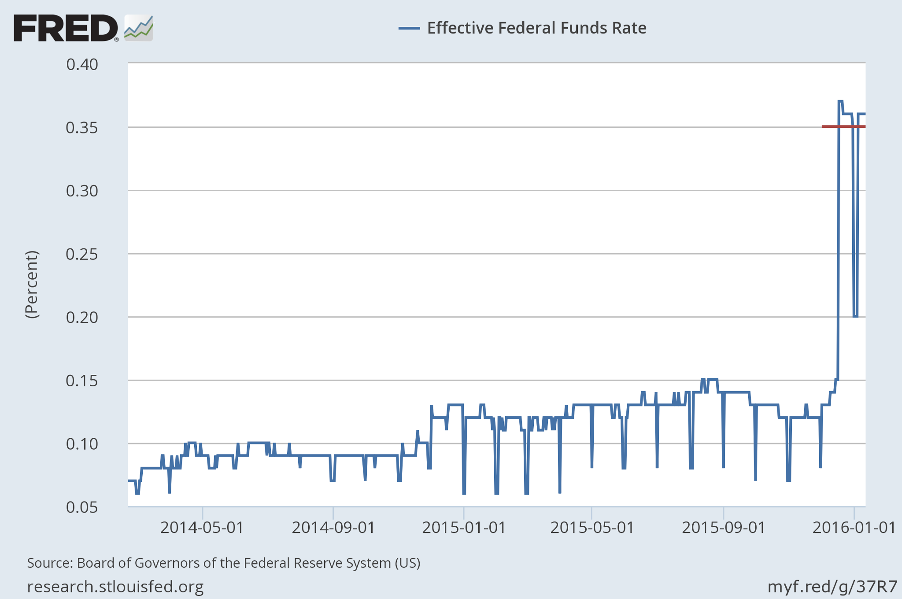

OK, this isn't specific to the information equilibrium model, but I think I did a pretty awesome job of estimating what the [effective Fed funds rate](https://research.stlouisfed.org/fred2/graph/?g=37R7) would be after the Fed's rate rise. [I predicted a value of 0.35%](http://informationtransfereconomics.blogspot.com/2015/12/the-effect-of-rate-increase-coming-out.html) (scenario C, a 0.25% rise in both the ceiling and floor rate) and we get ...

**Update 13 January 2016**

Here's an update with a bit more analysis of the log midpoint vs midpoint versions of the estimated EFF. Here are both estimates with data from 2011-present along with error and the error distribution:

I don't think this is necessarily the proper comparison, however. There are two periods where the EFF data is significantly above the blue line. Most of 2012 and most of 2015. I think these periods might represent _expectations_ of a rate hike -- and therefore aren't random errors, but systematic. Most of 2015 was spent asking when the Fed would finally "lift-off" the zero bound. And 2012 was the last time core PCE inflation had any quarterly data points above 2%. That optimism seems to have been terminated by the disastrous RGDP growth numbers from 2012 Q3 and Q4 (0.5% and 0.1%, respectively). In that case, the deviation above the estimate would be systematic, un-modeled effects rather than measurement error.
