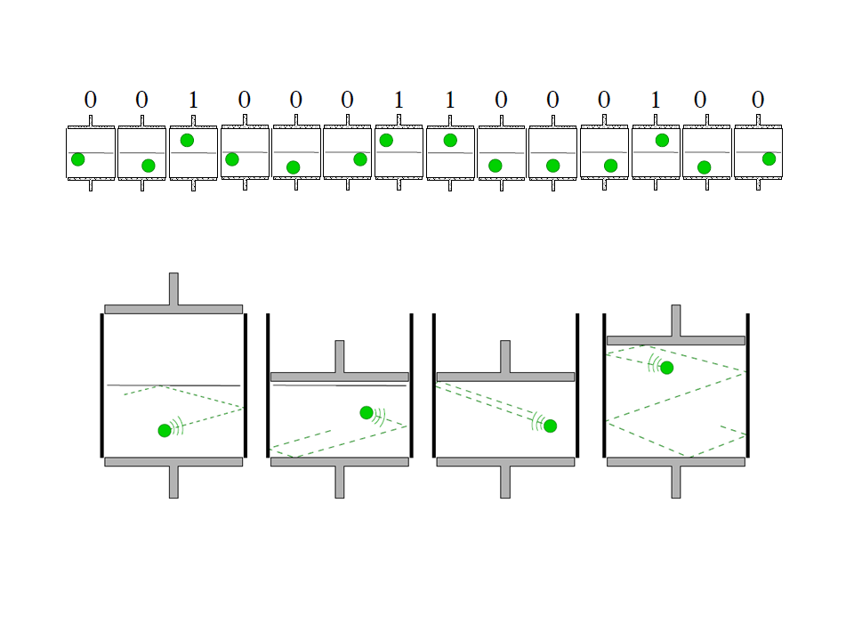

I was apparently too excited by a bit of convergence in thinking from [Noah Smith](http://www.bloombergview.com/articles/2014-10-10/the-market-outsmarts-everyone) and me in [this old post](http://informationtransfereconomics.blogspot.com/2014/10/entropy-in-three-pieces.html) (I recently used it as a reference, hence the re-read) that I forgot to call Noah out for not understanding information theory. I think it's a sufficiently delicate point that it deserves a whole post to discuss it and I don't fault Noah for making the mistake in a short article. The linked post from me is a good post and holds up well (in my very biased opinion); it received little traffic for some reason, so consider this a post bump as well.

Anyway, Noah says:

> _This is because the EMH doesn't emerge from any peculiarity of the way our market system is set up, or the way human beings behave. The EMH comes from something much deeper than that, something that probably has to do with information theory. It comes from the fact that when you exploit information to make a profit in a financial market, you decrease the amount that others can exploit that information. In other words, **the financial value of information gets used up** \[emphasis in original\]._

I agree the information in price movements is consumed, and the financial value of knowing the series of future price movements is used up if you trade on it.

But we must be careful to heed Shannon and Weaver's warning: **information theory is not about meaningful knowledge.** That is to say the [information](http://informationtransfereconomics.blogspot.com/2015/08/definitions-information-and-effective.html) we are exploiting in that series of price movements is the information entropy of those price movements, not "information" (meaningful knowledge) about earnings for example. These can be connected (with a model, which I talk about below), but are different concepts.

The precise analogy for the part I agree with would be [an engine that runs on information as proposed by Bennett](http://informationtransfereconomics.blogspot.com/2014/02/ii-entropy-and-microfoundations.html). In that example, we know the position of gas molecules in a piston and can exploit that information with a particular compression cycle:

However, figuring out all of those positions requires _k T log 2_ of energy per bit. For a macroscopic system, that would be so much energy that you'd affect the system -- hence this isn't feasible.

In financial markets, if you knew the series of price movements, you could exploit that information to sell high/buy low. This is actually what [HFT](https://en.wikipedia.org/wiki/High-frequency_trading) does (depending on the specific strategy). The more HFT players enter the game, the less exploitable information. And trades that are too big can affect the system. Gathering the required knowledge about the statistical regularities or particular stocks also takes time. So there are limits.

Note that I used the both the words information and knowledge in that paragraph -- that was on purpose and points out the distinction.

> **Information:** the price movements (if binary -- up or down a single unit -- this is a bit). Past price movements exist in the open market and aren't excludable. Future price movements don't exist and hence aren't excludable either. There is no meaning to these unless coupled with knowledge.

> **Knowledge:** the statistical regularities, HFT algorithms, or results of earnings reports (not measured in bits). It is excludable: people can "have" this and keep it from others.

In the quote above, Noah uses _information_ for both (the "information" in the price movements in connection to the EMH and the "information" in your possession that you use to make a profit). To be fair, so do the various formulations of the EMH and most economists. And really, this is my way of organizing this because there is a collision of the technical meanings of information in economics and information theory. I am keeping the technical definition of information from information theory and assigning two definitions to the undifferentiated concept in economics.

The best way to understand this is that you need a model to turn early knowledge of an earnings report into the information in a price movement. Is this earnings report good or bad? What are expectations? By how much? You might see that an earnings report shows a bigger than expected profit, but the stock could soar by a huge amount if the rest of the market is depressed (that company is the only light in the darkness). So you can see that earnings _e = x_ does not translate into price movement _Δp = y_. The price change _Δp_ has some information based on the distribution it is drawn from. The relationship between _e_ and _Δp_ requires some function with additional parameters _Δp_ _= f(e | a, b, c ... )_.

Generally, you can profit as long as the stock goes up and a good earnings report usually leads to a price rise. In that case you have an approximate equivalence between _e = good/bad_ and _Δp = up/down_ -- conflating information (for _Δp_) and knowledge (of _e_) isn't a problem.

This also means that the EMH requires all of those functions _f_ for every price _p_ in _Δp_ _= f(e | a, b, c ... )_ to be right in order to be true. In simpler terms: the EMH requires us to always know how to correctly translate knowledge into price movements. Or yet another way, the EMH requires us to have the correct model of economics in our heads. 

This may be plausible for the simple binary questions of up/down, good/bad. However, I suspect this might not be true in general and [I wrote a post awhile ago](http://informationtransfereconomics.blogspot.com/2014/11/is-market-monetarism-wrong-because.html) about how so-called excess volatility might arise from financial markets having the incorrect model.

I'll end with an example. Let's say you are given the following word guessing game:

**B I \_ \_ \_ O N**

**_Knowledge_** of American or British English or French would give you the approximately 3 × 1.3 bits = 3.9 bits of **_information_** to fill in the **L L I** in those languages. (Note it's not 4.7 bits per letter since not every letter combination is grammatical.) _Knowledge_ of those languages would also be necessary to know if this word meant 10⁹ or 10¹² (meaningful _knowledge_). You need a model (_knowledge_ of a language) to both guess and interpret the completed word.
