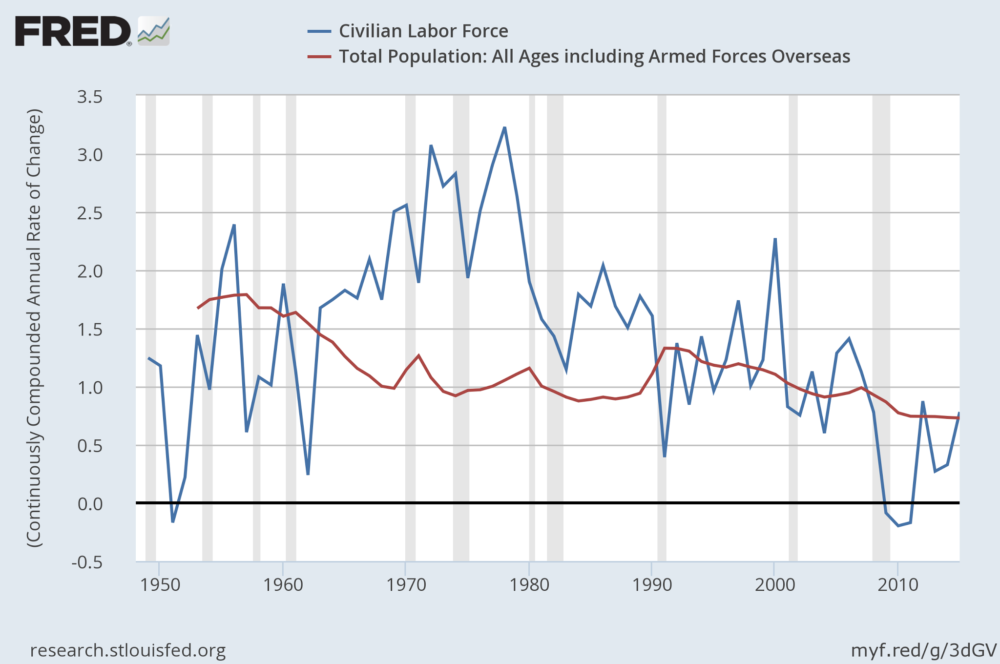

> **Update 25 Jan 2016:** This model gets much better: 

> [http://informationtransfereconomics.blogspot.com/2016/01/its-people-economy-is-made-out-of-people.html](http://informationtransfereconomics.blogspot.com/2016/01/its-people-economy-is-made-out-of-people.html) 

> **Update 23 Jan 2016:** Since this post is getting a lot more traffic than I expected, I'm adding a direct link to what is meant by information equilibrium and to my paper: 

> [http://informationtransfereconomics.blogspot.com/2015/12/information-theory-101-information.html](http://informationtransfereconomics.blogspot.com/2015/12/information-theory-101-information.html) 

> [http://econpapers.repec.org/RePEc:arx:papers:1510.02435](http://econpapers.repec.org/RePEc:arx:papers:1510.02435)

I noticed something today while randomly plotting various macroeconomic indicators, and so built an information equilibrium model to quantify it. The [civilian labor force (CLF)](https://research.stlouisfed.org/fred2/series/CLF16OV) looks a bit like core CPI, so I put together the information equilibrium model

_CPI ⇄ CLF_

So that

_log CPI = a log CLF + b_

and

_(d/dt)_ _log CPI = a (__d/dt)_ _log CLF_

which means that the inflation rate is _a_ times the labor force growth rate. This gives us a decent model (after adding a lag and smoothing the CLF -- a surprisingly noisy measure):

[Here's a version](https://research.stlouisfed.org/fred2/graph/?g=3dGJ) you can play with yourself at FRED where I fit _a = 2.67_. This model means CPI and CLF are in information equilibrium -- that fluctuations in CLF result in informationally equivalent fluctuations in CPI (plus noise).

This tells a different story of inflation in the US than exists in the mainstream, especially if you [compare the CLF growth rate with the population growth rate](https://research.stlouisfed.org/fred2/graph/?g=3dGV):

During the 1960s and 70s, we had a labor force growing faster than population -- typically associated with people other than white males entering the labor force (women, African Americans). This coincided with the period of high inflation in the US. As always, there is a question of causality -- the fit at the top of the post chose a lag of _y₀ = 0.33 years_ with CLF increases causing inflation about 4 months later.

The usual story of the end of the so-called great inflation of the 1970s was that the Volcker Fed managed to credibly rein in monetary policy, reducing inflation.

The new story is that either 1) the Fed was superfluous, or 2) the Fed's impact came through a different channel. In 1), the labor force had reached its new equilibrium participation rate, so it stopped growing as fast, lowering inflation. In 2), the Fed-caused recessions of the 1980s killed the rise in labor force participation (setting up the new equilibrium).

Similarly, the recent lack of inflation may have nothing to do with the Fed. We can see in the figure above the changes in the CLF roughly match the population growth rate. The recent lack of inflation is simply due to slow population growth in the US. It is quite a coincidence that as our population growth rate fell below 0.75% per year, it became hard for the Fed to maintain 2% inflation (given _a_ = 2.67).

The [lowflation](http://informationtransfereconomics.blogspot.com/2014/08/lowflation-is-meaningful-concept.html) in Europe, the US and Japan [may simply be low population growth](https://www.google.com/publicdata/explore?ds=d5bncppjof8f9_&ctype=l&strail=false&bcs=d&nselm=h&met_y=sp_pop_grow&scale_y=lin&ind_y=false&rdim=region&idim=region:ECS&idim=country:USA:JPN&ifdim=region&tstart=475228800000&tend=1390377600000&hl=en&dl=en&ind=false) -- and independent of the ECB, Fed. and BoJ. This would also mean inflation targeting by the central bank is a case of Feynman's cargo cult science -- they literally had zero control except to cause recessions by creating a coordinating signal for [sunspots](http://rogerfarmerblog.blogspot.com/2015/01/financial-crises-as-global-sunspots.html) \[1\].

Increasing labor force participation just leads to a spike in inflation that can last several years (as the US saw in the 60s and 70s). To generate sustainable inflation, governments would need to increase the population growth rate.

...

**Update #1**

With the relationship between the growth rates being _a ~ 3_, we can take population growth to be the growth in radius _r_ and inflation to be the growth in volume _V ~ r³_ of a sphere. While the volume numbers differ from the radius numbers, any signal in the change of the radius can be read off the change in volume.

**Update #2**

Also works for Japan

**Update #3**

And Canada

**Update #4**

Switched from LOESS smoothing to moving average for the US and Canada model since I used a moving average in the model for Japan.

**Update #5**

These posts on the "miracle" of a 2% inflation target ("magic number") alongside 2% inflation are relevant as well:

-   [By magic number, Nick Rowe means scale of the theory](http://informationtransfereconomics.blogspot.com/2015/12/by-magic-number-nick-rowe-means-scale.html)
-   [Miracles](http://informationtransfereconomics.blogspot.com/2015/11/miracles.html)

...

**Footnotes:**
\[1\] In Farmer's paper _Global Sunspots and Asset Prices in a Monetary Economy_, the Fed is Mr. W (the coordinating source of "sunspots"):

> _What coordinates beliefs on a sunspot equilibrium? Suppose that Mr. A and Mr. B believe the writing of an influential financial journalist, Mr. W. Mr. W writes a weekly column for the fictitious Lombard Street Journal and his writing is known to be an uncannily accurate prediction of asset prices. Mr. W only ever writes two types of article; one of them, his optimistic piece, has historically been associated with a 10% increase in the price of trees. His second, pessimistic piece, is always associated with a 10% fall in the price of trees._ 

> _Mr. A and Mr. B are both aware that Mr. W makes accurate predictions and, wishing to insure against wealth fluctuations, they use the articles of Mr. W to write a contract. In the event that Mr. W writes an optimistic piece, Mr. A agrees, in advance, that he will transfer wealth to Mr. B. In the event that Mr. W writes a pessimistic piece, the transfer is in the other direction. These contracts have the effect of ensuring that Mr. W’s predictions are self-fulfilling._
