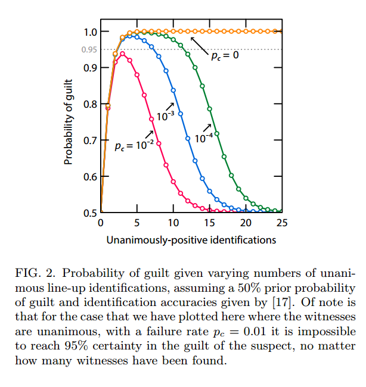

[Alex Tabarrok points us](http://marginalrevolution.com/marginalrevolution/2016/01/too-good-to-be-true.html) to an illustration of what can go wrong with people who think they are using Bayesian reasoning -- and with the strange drive to produce counterintuitive results.

> _In an excellent new paper, "Too Good to Be True", Lachlan J. Gunn et al. show that **more evidence can reduce confidence.**_

Emphasis in the original. They use a police line-up as their example.

Say you have a police line-up and ask witnesses to identify the suspect.  Assuming the prior probability of guilt is 50%, independent witnesses and a "probability of systemic failure" _pc_ for all the witnesses (i.e. the suspect was a clown, but only one of the people in the line-up is dressed as a clown) ... they find that additional positive identifications should lead to less confidence in the result. Here is a graph:

What is happening here is that you should suspect "systemic failure" given the conditions above -- you can tell because it primarily depends on _pc_. That was our easy out (only option) given the conditions above \[1\].

But that neglects the other possibilities -- including one big one. The witnesses are not independent in any way. They saw the same thing -- they are correlated by the event motivating the line-up itself.

Imagine you get a group of "witnesses" who go in a room where someone flips a coin. They come out and you ask what the result of the flip was. If 100 people say it was heads, you have to conclude (with suitably high confidence): the people are conspiring (systemic failure), the coin was double heads (systemic failure), or unfair (prior not 50%). But it could also be that **the witnesses all saw the same coin flip** (or 90 of them did and then 10 saw a different flip that also came out heads).

Basically the paper shows more evidence can reduce confidence in the evidence or experiment **if you hold onto your assumptions.** If something is too good to be true, maybe you should question your assumptions -- and not chalk it up to conspiracy or incompetence.

**Footnotes**

\[1\] There is also the issue of identification accuracy, but your sample of witnesses might not have that distribution of accuracy for whatever reason. This goes into the prior model anyway, so doesn't impact the main thesis here that you should also question your priors ... and not just systemic failure.
