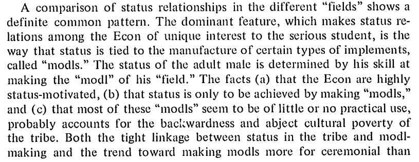

[This is a nice executive summary](http://bruegel.org/2016/01/the-use-of-models-by-policymakers/) of the latest discussion of modls, I mean models \[[pdf](http://www.econ.ucla.edu/alleras/teaching/life_among_the_econs_leijonhufvud_1973.pdf)\], among Krugman, Summers, DeLong, Wren-Lewis ... and I'd like to add Robert Waldmann (link below).

My opinion is [here](http://informationtransfereconomics.blogspot.com/2015/11/math-up.html) and it best aligns with Krugman's. The key point is that neither I nor anyone else can use your intuition until you put it in math (or other formal system like supply and demand curves). Language is simply not up to the task.

In fact, Robert Waldmann (in comments [here](http://www.bradford-delong.com/2016/01/early-monday-delong-smackdown-larry-summers-on-how-we-know-more-than-we-write-down-in-our-lowbrow-or-highbrow-economic-m.html)) points out correctly that the implicit model suggested by what Summer's says is quite weird:

> _The challenge for Fed hawks is to explain how unemployment slightly below the NAIRU can cause sharply acceleration inflation when unemployment far above the NAIRU didn't cause noticeably decelerating inflation. That requires a kinked Phillips curve which is not standard at all._

Waldmann is fine with a coherent story, but says even that low bar hasn't been met:

> _Krugman says "show me the model". I don't. I say tell me the story. "Once account is taken of the impact of a currency collapse on consumers’ real incomes, on their expectations, and especially on the risk premium associated with domestic asset values, it is easy to understand how monetary and fiscal policymakers who lose confidence and trust see their real economies deteriorate" is a list of topics and an assertion that it is easy to tell a story. it isn't a story._
