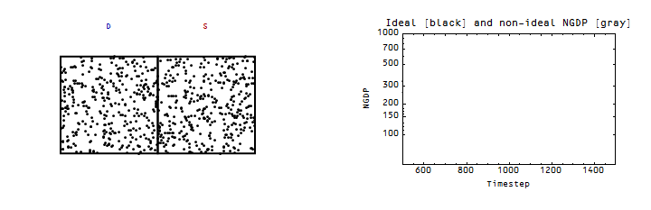
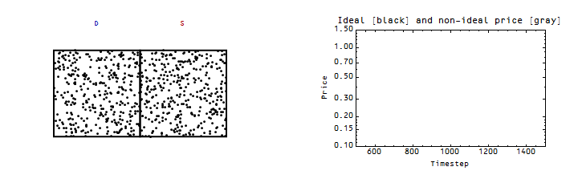

I updated graphs [here](http://informationtransfereconomics.blogspot.com/2016/01/its-people-economy-is-made-out-of-people.html) (originally from [here](http://informationtransfereconomics.blogspot.com/2015/03/non-ideal-information-transfer-tail.html)) to show what happens to the price level and nominal output during a shock in the presence of growth (first is nominal output, second is the price level, both showing ideal and non-ideal information transfer):

