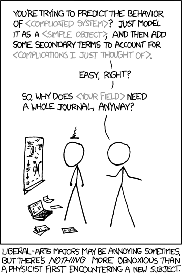

Someone posted [this XKCD comic](https://xkcd.com/793/) on the [EJMR forum](http://www.econjobrumors.com/topic/nick-rowe-gets-super-mad-in-comments) in reference to my blog, specifically this series of posts ([\[1\]](http://informationtransfereconomics.blogspot.com/2015/06/ramsey-model-and-unstable-equilibrium.html), [\[2\]](http://informationtransfereconomics.blogspot.com/2015/06/the-importance-of-transversality.html)).

And I agree this is a pretty good takedown of physicists jumping over into other fields ([this is another good one](http://bactra.org/weblog/517.html) specific to economics). But it also represents a complete misunderstanding of what the posts were about and my general approach.

**_Just model it as a < simple object > ..._**

My actual criticism was that the RCK model was vastly more complicated than economists made it out to be (even in a graduate level textbook) and that transversality conditions were actually most of the economic content of the model. The differential equations defining the model itself were little more than accounting identities.

**_... add some secondary terms to account for < complications I just thought of > ..._**

I hadn't just thought of the complications -- they were the primary subject of the post. Nick Rowe and commenter LAL, both economists, made the same assumption that it was just neophyte musings and I had missed the point of the transversality conditions. But again, the main point was that transversality conditions were most of the economic content of the model.

**_... why does < your field > need a whole journal, anyway?_**

What's funny about this piece of the comic is that the entire reason I was looking at the RCK model was that I was going through Romer's _Advanced Macroeconomics_ (the aforementioned graduate level textbook) and trying to learn economics as one would as a member of the field.

In addition, I take great pains to attempt to reproduce mainstream economic results using the information equilibrium framework. For example:

> [Euler equation](http://informationtransfereconomics.blogspot.com/2015/06/the-euler-equation-as-maximum-entropy.html) 

> [Asset pricing equation](http://informationtransfereconomics.blogspot.com/2015/05/the-basic-asset-pricing-equation-as.html) 

> [Lucas islands](http://informationtransfereconomics.blogspot.com/2015/04/towards-information-equilibrium-take-on.html) 

> [Diamond Dybvig](http://informationtransfereconomics.blogspot.com/2015/04/diamond-dybvig-as-maximum-entropy-model.html) 

> [AD-AS, QTM, IS-LM, Okun's Law, Liquidity trap ...](http://informationtransfereconomics.blogspot.com/2015/08/information-equilibrium-as-economic.html)

In the end, I think economics is an interesting and complex field (hence why I spend so much of my free time working on it), not something trivial that can be solved quickly by writing down the right Lagrangian. I do think economists have framed the problem incorrectly (in terms of individual human behavior), but many economists share at least part of that criticism (problems with microfoundations).
