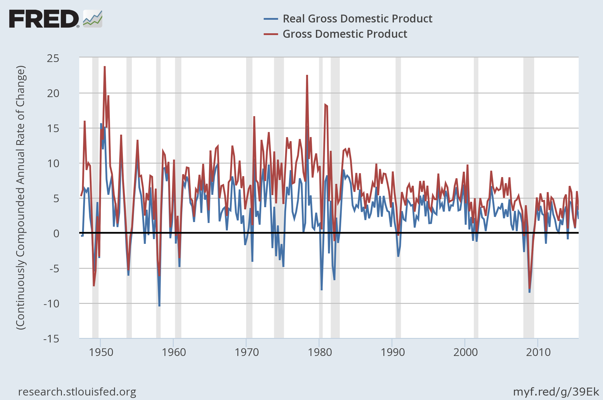

[Dietz Vollrath has a nice post](https://growthecon.wordpress.com/2016/01/15/do-you-need-more-money-for-economic-growth-to-occur/) about economic growth, real and nominal. It's a great pedagogical introduction to the mainstream growth econ view of things. For example, he says:

> _Whether nominal GDP rises or not is **completely irrelevant** to whether real GDP goes up._

Emphasis in the original. And this is true of growth econ. But it's not true in practice; the two time series track each other fairly closely implying some kind of relationship ([data from FRED](https://research.stlouisfed.org/fred2/graph/?g=39Ek)):

Now this is usually attributed to the central bank maintaining stable inflation, in which case real growth _ρ_ would be just nominal growth _ν_, minus some central bank established rate of inflation _π₀_:

_ρ ~ ν – π₀_

As an aside, the divine coincidence was the belief that stabilizing inflation would stabilize growth (output gap) as well. Anyway, this means the explanation for _ρ_ tracking _ν_ is that they are independent, **but** the central bank controls inflation. Which makes this statement from Vollrath interesting (this quote cuts across a few paragraphs):

> _In all the examples above, what is the stock of money? You can’t answer that question, because I never said anything about it. ... The level of absolute prices is irrelevant. ...The stock of money is irrelevant._

But how can the stock of money be irrelevant if the central bank controlling inflation is what is required in order to reproduce the empirical result that real output tracks nominal output very closely?One way to square that circle is that the stock of money is irrelevant to inflation. It does seem to be true in a liquidity trap, but otherwise [the relevance is a stylized fact of economics](http://informationtransfereconomics.blogspot.com/2015/06/the-quantity-theory-of-money-as.html). In a sense, the actual empirical data above _should_ depend on the stock of money because it is related to the stock of money necessary to keep inflation on its independent path.

The end result is that the mainstream growth econ explanation for _ρ_ tracking _ν_ is that they are independent, and the price level is irrelevant, **but** the central bank controls this irrelevant price level in order to reproduce the empirical fact that ρ and ν fluctuate together.

Is this starting to feel a bit Rube Goldberg-y to you? 

In the [information equilibrium (IE) model](http://informationtransfereconomics.blogspot.com/2015/08/information-equilibrium-as-economic.html), you don't need to have the central bank controlling inflation to get the same result. Using the model [at the bottom of this post](http://informationtransfereconomics.blogspot.com/2016/01/draft-paper-for-talk-this-summer.html), we have (if _μ_ is the growth of the relevant money supply and _k_ is the information transfer index)

_ν ~ k μ_

_π ~ (k – 1) μ_

so that

_ρ ~ ν – π ~ μ_

and therefore 

_ν ~ k ρ_

Basically, nominal and real growth are roughly proportional to each other, which explains the correspondence in the empirical data without the central bank having an impact. If _k = 2_, then we have the quantity theory of money and

_ν ~ 2 μ =_ _ρ +_ _π_

_ρ ~ μ_

_π ~ μ_

Note the historical average is ν/ρ ≈ 1.87 (1.31 after 1980). [But a changing _k_](http://informationtransfereconomics.blogspot.com/2014/06/the-macroeconomic-partition-function.html) doesn't interfere with the result that at any given time we have _ν ~ k ρ_. It's a simpler way to explain the empirical data. Real and nominal growth track each other because they aren't independent -- not because they are independent and something makes them dependent.

Just because it is simpler doesn't make it the real explanation, though.
