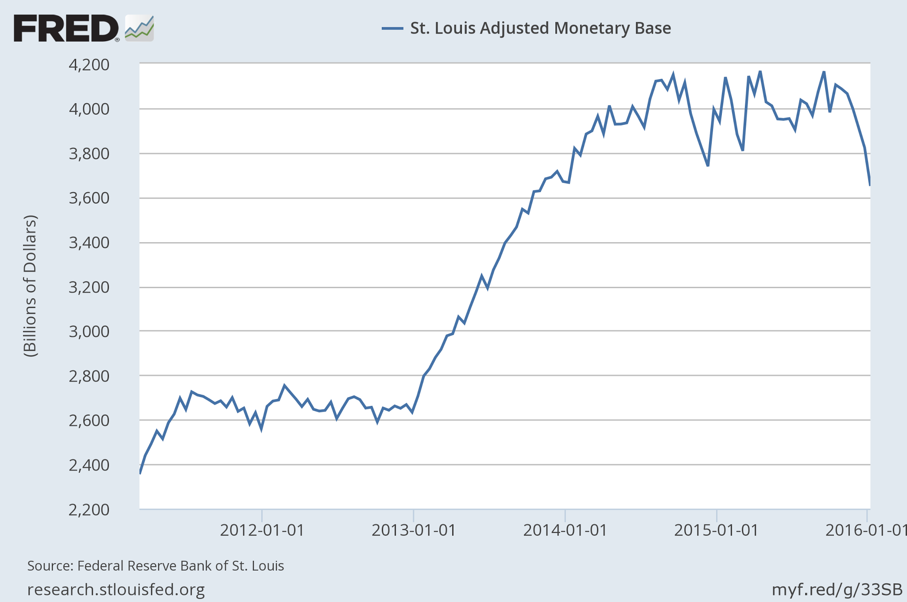

FRED just released the [bi-weekly data](https://research.stlouisfed.org/fred2/graph/?g=33SH) for the monetary base (it showed it was updated 14 seconds ago when I looked at it) and it appears to be on the downward path towards the [information equilibrium prediction](http://informationtransfereconomics.blogspot.com/2015/12/zirp-is-over-let-experiment-begin.html) of about 2.6 trillion:

I'll update the model graph when I get a chance \[**update:** updated, with additional zoomed in version\] ...

