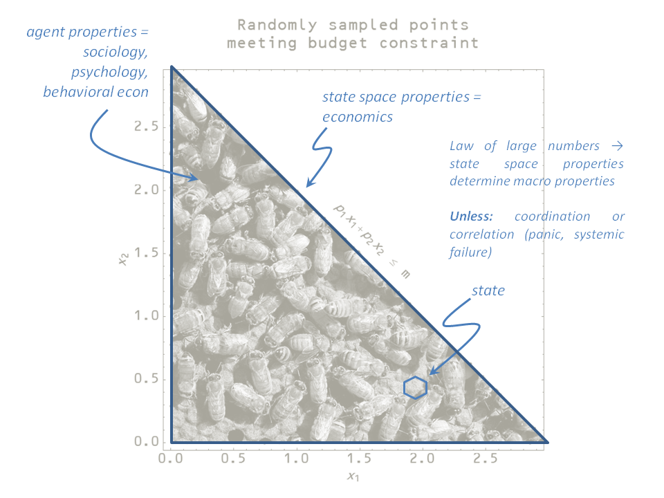

The word _natural_ famously has no particular meaning when it comes to food products. [Cullen Roche has taken on](http://www.pragcap.com/theres-nothing-natural-about-the-economy-and-the-financial-markets/) the meaning of _natural_ in terms of markets. He says:

> _The point is that our entire economy is a human construct. ... There is no “natural” order to all of this._

There is no denying the economy is a human construct. But it does not follow that there is no natural order to it. For example, the internet is a human construct. But it has a natural order described by [information theory](https://en.wikipedia.org/wiki/Channel_capacity) (communication) and [queueing theory](https://en.wikipedia.org/wiki/Queueing_theory). This natural order emerges when the properties of the state space define the system rather than the behavior specific units of traffic in limits like the [heavy traffic approximation](https://en.wikipedia.org/wiki/Heavy_traffic_approximation). (See also [here](http://informationtransfereconomics.blogspot.com/2014/12/an-information-transfer-traffic-model.html).)

Likewise, I think the economy has a similar limit where the properties of the state space (opportunity set) become more important than the properties of the agents. I've written about this before [here](http://informationtransfereconomics.blogspot.com/2015/10/economics-as-and-versus-social-science.html), where I drew this diagram:

When humans aren't panicking and there are lots of transactions, the state space determines how many macroeconomic aggregates behave.

For example, Cullen would probably disagree with my hypothesis that there is a natural interest rate associated with a given NGDP and monetary base that can be used to predict what the monetary base will be in 2016 (see [here](http://informationtransfereconomics.blogspot.com/2015/12/the-effect-of-rate-increase-coming-out.html), [here](http://informationtransfereconomics.blogspot.com/2015/12/zirp-is-over-let-experiment-begin.html) and [here](http://informationtransfereconomics.blogspot.com/2016/01/on-our-way-down.html)):

The figure shows the predicted future stable value (in the absence of additional rate changes) labeled option C [here](http://informationtransfereconomics.blogspot.com/2015/12/the-effect-of-rate-increase-coming-out.html) before the Fed's rate decision, which was a 25 bp rise to a range of 0.25% to 0.5%. I'd say this represents a test of the idea that there is some natural order to the economic system.
