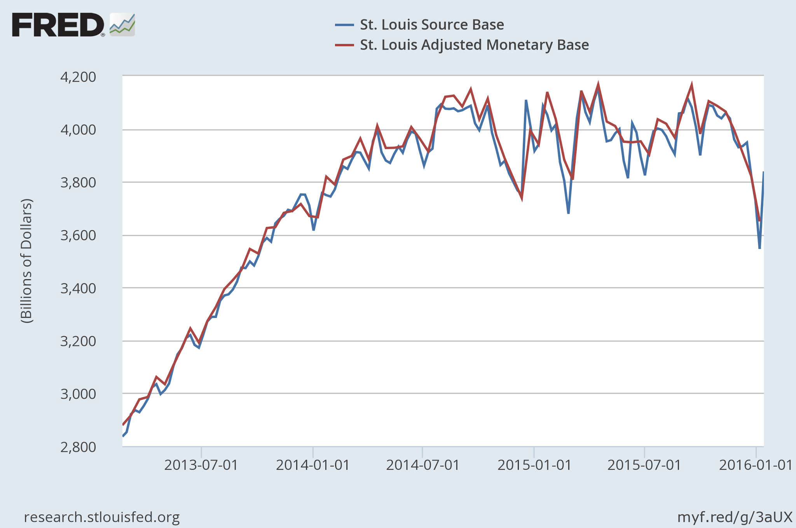

Later this week, we'll get the new bi-weekly monetary base data to compare with [the prediction](http://informationtransfereconomics.blogspot.com/2016/01/on-our-way-down.html), but the source base (that the seasonally adjusted bi-weekly number closely tracks) has gone back up \[[source](https://research.stlouisfed.org/fred2/graph/?g=3aV7)\]:

