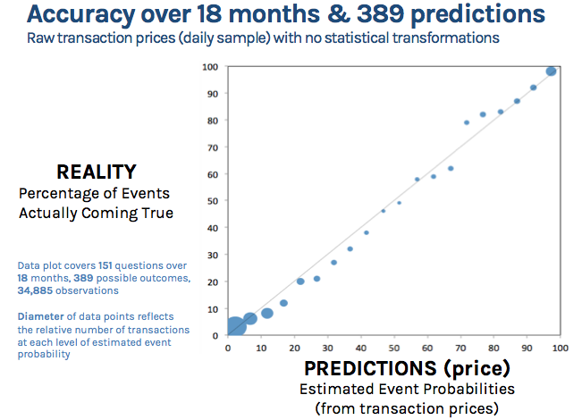

The 1st estimate of 2015 Q4 NGDP data is available on FRED today. It appears [Hypermind](https://hypermind.com/hypermind/app.html?fwd=#welcome) has removed its NGDP predictions before I had a chance to update them in the graph (and [Scott Sumner has removed it from his blog's front page](http://www.themoneyillusion.com/)). So all I have to go with is the data I had when I made the graph [back in July after Q2 results](http://informationtransfereconomics.blogspot.com/2015/07/comparing-ngdp-predictions-with-results.html). Here are the updated graphs, now with annual and quarterly predictions/data separated (last Hypermind predictions are in black, previous in grays):

The prediction markets result for 2015 growth is basically indistinguishable from a log-linear extrapolation of data (shown as red dashed lines) from after 2009. The ITM (gray dashed curves) was almost exactly right, but I wouldn't read too much into that since it's not terribly different from the log-linear extrapolations (all time: solid red, since 2009: dashed red) itself.

Hypermind's [blog](http://blog.hypermind.com/) doesn't mention the NGDP markets except generically mentioning macroeconomics: "All the predictions so far have been about politics, geopolitics, macroeconomics, business issues, and some current events." They do show a funny plot that I've seen in the research before:

The information transfer view predicts this sort of result from purely random behavior as I show in this blog post from last October:

> _[Corporate prediction markets aggregate random behavior](http://informationtransfereconomics.blogspot.com/2015/10/corporate-prediction-markets-aggregate.html)_

The data is closer to the line in the Hypermind case simply because there were more markets and measurements, making the ideal information transfer picture a better approximation.
