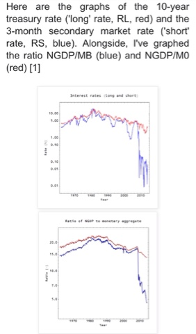

It looks like Scott Sumner has written down the models _r :_ _N ⇄ M0_ and _r : N ⇄ MB_

[http://www.themoneyillusion.com/?p=31387](http://www.themoneyillusion.com/?p=31387)

He just needs to plot _log r_.

[http://informationtransfereconomics.blogspot.com/2014/11/quantitative-easing-cleanest-experiment.html](http://informationtransfereconomics.blogspot.com/2014/11/quantitative-easing-cleanest-experiment.html?m=1)

**PS** Here was the previous one:

[http://informationtransfereconomics.blogspot.com/2015/08/scott-sumners-information-equilibrium.html](http://informationtransfereconomics.blogspot.com/2015/08/scott-sumners-information-equilibrium.html?m=1)
