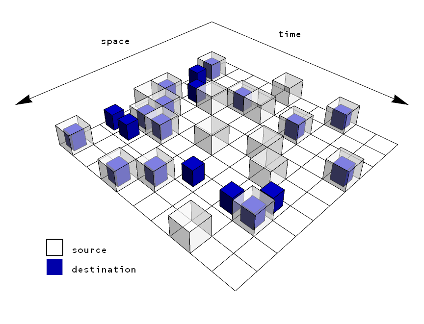

I think the greatest trick economists ever pulled was that economics is about our well-being. The so-called fundamental theorems of welfare economics are based on a peculiar defintion of welfare (see [here](http://www.interfluidity.com/v2/5149.html) for an in-depth view). And people such as Diane Coyle point out that measures like GDP don't capture our well-being, innovation or quality of life. That came up in [Chris Dillow's latest post](http://stumblingandmumbling.typepad.com/stumbling_and_mumbling/2016/01/innovation-well-being.html) on the subject where I found the following quote:

> _The biggest difference between New Yorkers and primitive tribes, he says, isn’t the “mere 400-fold difference” in their incomes, but rather the 100 million-fold difference in the number of products available to them._

Not only is "primitive" in the eye of the beholder, but so is the linear difference between 400 and 10⁸. If [money represents information](http://informationtransfereconomics.blogspot.com/2015/06/the-definition-origin-and-purpose-of.html), then the proper measure would be the logarithms

_log 400 ~ 6_
_log 10⁸ ~ 20_

Economics doesn't strongly depend on innovation (measured crudely with the number of products). Each new product adds only about _1/n_ to _log n_, meaning each new product adds a smaller and smaller amount to the total amount of information that needs to be gathered in order to compute the allocation.

Economics is not and should not be about us as humans \[1\]. That might even [get in the way of understanding economics](http://informationtransfereconomics.blogspot.com/2014/08/against-human-centric-macroeconomics.html) (or may just be [unnecessary](http://informationtransfereconomics.blogspot.com/2016/01/draft-paper-for-talk-this-summer.html)). Economics is about the functioning of [a particular allocation algorithm](http://informationtransfereconomics.blogspot.com/2015/01/is-market-intelligent.html) (see also [here](http://informationtransfereconomics.blogspot.com/2015/05/the-economic-allocation-problem.html)). Full stop. Politics and philosophy is about us as humans and our well-being as a society.

**Footnotes**

\[1\] See also [this](http://www.perc.org.uk/project_posts/the-difficulty-of-neoliberalism) (H/T [@UnlearningEcon](https://twitter.com/infotranecon/status/686636756494499840)). Making human progress and well-being all about economics is probably the best operational definition of "neoliberalism".
