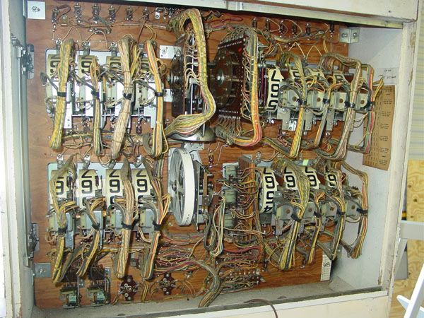

Via [here](http://crookedtimber.org/2016/01/23/twas-mine-tis-his-and-has-been-slave-to-thousands/) I was linked to [Brad DeLong's old deep-dive into the fever swamps of Austrian economics](http://delong.typepad.com/sdj/2012/09/paul-krugman-asks-a-question-on-the-austrian-hatred-of-fractional-reserve-banking-paper-money-etc-weblogging.html) and general goldbug-ism which concludes:

> _Thus I interpret \[Austrian economics\] as the survival at a prelogical level of a deep attachment to a cost-of-production theory of value, whereby it is the sin of the Mammon of Unrighteousness for anything that can be produced as cheaply as fiat money is to actually have value, and that sin must bring fearful retribution from the Gods of the Market._

I think this is both hilarious and really captures some people's view of money: _I did or made something of value and received this worthless green paper in return that no one labored to make?_

Actually, I think a pinball analogy is good here. In the days of electro-mechanical scoreboards (pictured above), there at least was some labor going into registering your points you got in return for hitting that ramp. But as games shifted to easily produced electronic numbers, there was [massive point inflation](http://acgoldis.blogspot.com/2007/04/inflation-of-pinball-machine-scores.html).

However -- despite how many billionaires would like it to be so -- money isn't points. That basic idea confuses what money does. Points put a rank-orderable value on your "labor" going into the flippers. But you don't compare scores on different machines. Does a low level executive at Walmart really do as much good as a doctor where both make about the same amount of money? Does a doctor in the US do much more good than a doctor in ... well, just about every other country on earth? 

Not really. Or at least not in any objective way.

That's because money is an algorithm for solving an allocation problem. And there are two issues with the solution it finds:

1.  The allocation problem is so complex that there is no way of telling whether the market allocation is optimal or not, regardless of your (subjective) objective function \[1\].
2.  The market tends to find maximum entropy allocations \[2\] ... which tend to be a result of randomness in other systems.

So unlike pinball where high scores (on the same machine) can be used to rank-order players based on their own efforts, it is unknown if people with lots of money represent an optimal allocation \[3\] or if they got there through their own effort. In fact, there are lots of reasons to believe neither is true -- just look at the research on CEO pay and on inequality.

That's why your labor can be translated into fiat currency. That currency stands for a particular solution to the allocation problem, not an objective value for your labor.

And that's why we can live in a society where fiat currency has no intrinsic value -- and potentially manipulate its supply (price) to mitigate macroeconomic fluctuations.

...

**Footnotes**

\[1\] I got this from Cosma Shalizi, and I talk more about this and the market allocation problem (versus the market information problem) [here](http://informationtransfereconomics.blogspot.com/2015/01/is-market-intelligent.html). 

\[2\] Actually, the market tends to find maximum entropy allocations that are constrained by the average value of _< log x >_ ... Pareto distributions.

\[3\] Brad DeLong has a good discussion on the market's social welfare function ([here](http://delong.typepad.com/sdj/2009/04/hoisted-from-the-archives-a-non-socratic-dialogue-on-social-welfare-functions.html) or [here \[pdf\]](http://holtz.org/Library/Social%20Science/Economics/The_Market's_Social%20Welfare%20Function%20-%20Delong.pdf))
