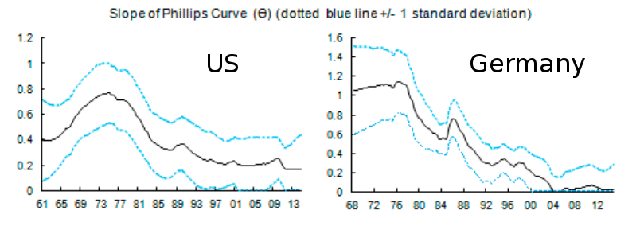

There was (H/T [Brad DeLong](http://equitablegrowth.org/must-read-olivier-blanchard-et-al/)) a working paper out of the IMF in November of 2015 from Olivier Blanchard, Eugenio Cerutti, and Lawrence Summers titled \[[pdf](https://www.imf.org/external/pubs/ft/wp/2015/wp15230.pdf)\] _Inflation and Activity – Two Explorations and their Monetary Policy Implications_. In it they plot the slope of the Phillips curve (second graph), falling from the 1960s to the present:

They say "\[the Phillips curve slope\] today is not only small, but statistically insignificant". Here is the result for the US (and Germany) in Figure 9 referenced in the graphic above:

This is consistent with [my own finding](http://informationtransfereconomics.blogspot.com/2015/11/non-deflation-non-surprise.html) (also from November of 2015):

The relative normalization of the slope is not relevant (the Phillips curve relates annualized percentages of inflation and unemployment, where as this is presented as a fractions -- you multiply by 12 to get annualized inflation and the Blanchard _et al_ result).

Another observation is that the era of the Phillips curve corresponds to the era of the labor force growing faster than the population -- of increasing participation rate. [If inflation is just related to labor force growth](http://informationtransfereconomics.blogspot.com/2016/01/is-cpi-information-theoretic-measure-of.html), then the Phillips curve would have primarily been about the temporary alignment  of employment growth and increasing participation rate.
