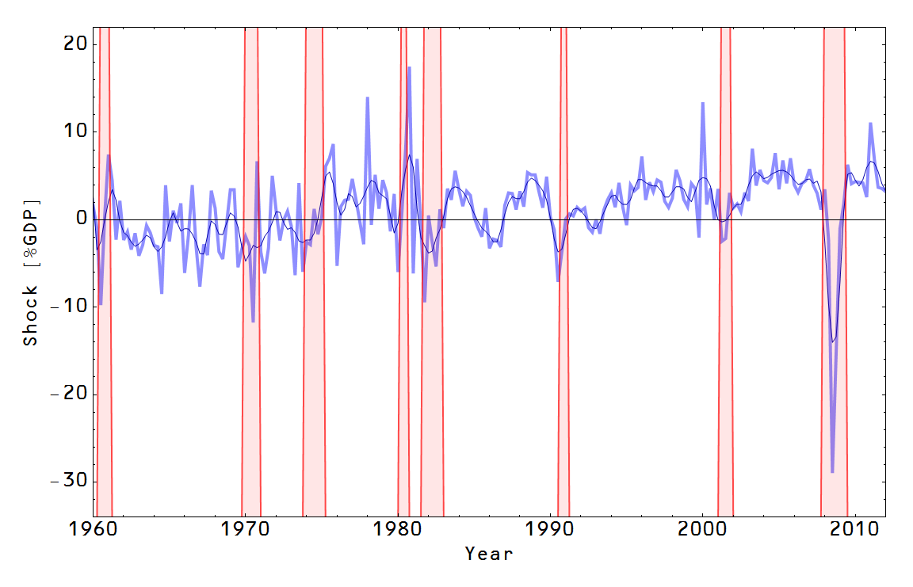

[a re-post of a random reference](http://informationtransfereconomics.blogspot.com/2013/09/ch-ch-ch-changes.html)

## Friday, September 27, 2013

### Ch-ch-ch-changes.

I was re-reading [this post](http://noahpinionblog.blogspot.com/2012/07/steve-williamson-explains-modern-macro.html) (and the one Noah Smith [links to in it](http://newmonetarism.blogspot.com/2012/07/hp-filters-and-potential-output.html)) about what we mean by economic cycles, (or even how to extract the effects of policy changes; [this](http://informationtransfereconomics.blogspot.com/2013/09/six-points.html) seems like a bad way to do it) and thought I should update my take on it.

The procedure I came up (for what is essentially a quantity theory of money) is to extrapolate where the economy would be if the monetary base increased from time T1 to time T2 (which generally increases the price level) but GDP remained the same when adjusted for inflation. Call this point GDP0(T2). I then looked at the remainder when I took the difference GDP(T2) - GDP0(T2). Basically this is the distance the actual GDP is from the GDP you expected to arrive at given monetary policy. Graphically, the process is described [here](http://informationtransfereconomics.blogspot.com/2013/07/extracting-nominal-shocks.html) where I referred to that remainder as a "nominal shock". Here is a graph based on NGDP data (dark blue is a LOESS smoothing and red indicates recessions):

I also went back to [this fit to all the data since 1929](http://informationtransfereconomics.blogspot.com/2013/09/exit-through-hyperinflation.html) (using GNP instead of GDP) and extracted these nominal shocks (the colors correspond to the different monetary policy regimes described in the link):

