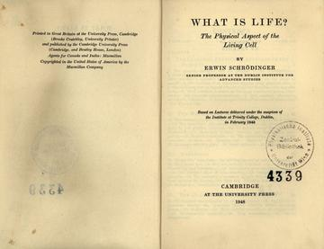

-OG.JPG)

It's probably hubris for a physicist to say what is or isn't economics, but I'll have a go anyway. [My last post](http://informationtransfereconomics.blogspot.com/2016/01/false-dichotomy-as-in-both-choices-are.html) was about how it appears that technology and government don't have first order effects on the macroeconomy. In response, [Commenter Jamie](http://informationtransfereconomics.blogspot.com/2016/01/false-dichotomy-as-in-both-choices-are.html?showComment=1454256617457#c2639644989652139352) said something very interesting:

> _That suggests to me that there is a serious mismatch between interesting economic questions and current macroeconomic techniques._

Here is part of my reply:

> Indulge me in a paraphrase: 

> "That suggests to me that there is a serious mismatch between interesting scientific questions (species adaptation, life in the universe) and current physics techniques." 

> At one time, some physicists did have some contributions to biology (e.g. Schrodinger's _What is Life?_), but really since the beginning physics techniques were never matched up with scientific questions from biology. Hence they are different fields. 

> In my view, the subjective impact of technology on our lives is the domain of sociology anthropology, and history. It's economic impact can vary from nil to huge. 

> Another analogy: in some cases, the biosphere has limited impact on our understanding of geology (volcanism, plate tectonics); in others it is huge (carbon and water cycles, oxygenated atmosphere). But in general, you shouldn't start to try to answer a geological question with biology. Start with plate tectonics, glaciation and sea level changes. 

Sure, it is possible that the biosphere can cause things to happen that lead to those glaciation events or global warming (I wouldn't even discount the hypothesis that biological processes could help lubricate plate tectonics). And biology may be critical to the coefficients in those [effective](http://informationtransfereconomics.blogspot.com/2015/08/definitions-information-and-effective.html) geological processes (biology determines the composition of the atmosphere, for example). You could say: it's all atoms, so atoms have to be important. But that importance shows up as e.g. the triple point temperature of water ... once you have that (even empirically) you don't need quantum chemistry to understand geology. You don't need to know the specific ecological niche of coccolithophores (or other biological details) to understand the cliffs of Dover; you just need three: that they live in the water, their abundance and that they have shells of calcium carbonate.

One thing to keep in mind is this: If social and psychological effects (properties of agents) are integral, then we should probably give up on economics because it becomes a [multi-million dimensional agent problem and therefore intractable](http://informationtransfereconomics.blogspot.com/2014/06/what-if-money-was-made-of-vinegar.html). If you think there is a real thing called "the macroeconomy", "the market" or "social welfare" (or "representative agents" or "inequality"), then you're already headed down the path of dimensional reduction -- and it becomes only a question of how far. The macroeconomy can't simultaneously be a complex nonlinear system critically dependent on its constituent agents and something with comprehensible aggregate properties. 

With that in mind, I thought I'd make a handy list (that might grow, shrink or change) for how the information transfer framework sees the field of economics:

-   **Quality of life:** This is largely a question for politics, psychology, sociology and history. How we subjectively experience the world around us seems to only loosely correlate with money, and even in that case it's only poverty is the proximate cause to low quality of life. Because of our system, some people can't afford basic needs. If basic needs were directly provisioned by the government, then I suspect the correlation between quality of life and money would fall precipitously. Another way: it is a failure of the market allocation mechanism to match up the market allocation with social welfare. However, that has little bearing on how the market allocation algorithm works. Conclusion: not economics.
-   **Economic growth:** There are a couple of information equilibrium models where economic growth seems to flow from macro aggregates of "widgets" ([labor supply](http://informationtransfereconomics.blogspot.com/2016/01/its-people-economy-is-made-out-of-people.html) or [money supply](http://informationtransfereconomics.blogspot.com/2015/08/information-equilibrium-as-economic.html)), so long run economic growth seems to be about the allocation problem, not about society, history or culture. Causation might actually go the other way with economic growth (or lack of it, or lack of equal gains among segments of society) leading to political cohesion, unrest, revolution and warfare. Functioning markets that lead to economic growth need to be set up by governments (or general social trust), but once operational, these impacts likely enter though coefficients (e.g. higher information transfer indices in countries with more "trust"). Social effects are probably second order effects on the coefficients rather than terms in the model. Conclusion: economics.
-   **Recessions:** Not well understood. Possibly an interesting interaction between group psychology/sociology and macroeconomics via financial markets. The information transfer framework can model recessions as [non-ideal information transfer](http://informationtransfereconomics.blogspot.com/2015/03/non-ideal-information-transfer-tail.html) (market failure), or falls in entropy ([coordination of agents](http://informationtransfereconomics.blogspot.com/2014/10/coordination-costs-money-causes.html)). It could also just be [avalanches](http://informationtransfereconomics.blogspot.com/2014/09/recessions-and-avalanches.html) set up by a "snow pack" of macro aggregates (via the central bank) and triggered by financial crises and or the central bank. In general, recessions happen in a background of an information equilibrium solution -- you need to understand that first to know how recessions work. Conclusion: maybe economics.
-   **Inflation:** This doesn't appear to be independent of economic growth, but rather just another measure of the same thing. In most information equilibrium models with good empirical results we have nominal output _N ~ k log X_ and price level _P ~ (k - 1) log X_ where _X_ is some macro aggregate like labor supply or money supply. So _P_ isn't really independent of _N_. Hyperinflation, [though it can be tackled by the information equilibrium model](http://informationtransfereconomics.blogspot.com/2013/09/exit-through-hyperinflation.html), is probably more a socio-political/psychological problem. In a sense, when inflation stops being well-described by an information equilibrium model, it's probably a political problem. It might be connected to [pegged interest rates](http://informationtransfereconomics.blogspot.com/2015/04/will-uk-be-first-to-exit-great-recession.html). Conclusion: economics.
-   **Technology:** Some aspects of technology lead to impacts on macro aggregates (like public health on the labor supply) that leads to growth. Other technologies are nothing more than additional widgets where the identity of the widgets doesn't matter to the economic allocation problem. Communication advances probably lead to a speeding up of the exploration of the economic state space (as well as speeding up and increasing the size of deleterious coordinations like mass panics). The technologies that are just widgets are best left to sociology, anthropology and history. The measures of technology in economics might just [measure economic entropy](http://informationtransfereconomics.blogspot.com/2015/05/cobb-and-douglas-didnt-have-changing.html). Conclusion: generally not economics.
-   **Government (institutions):** My view is that government basically can act as a "helpful coordination", convincing people not to panic, encouraging them to not give into the paradox of thrift, or employ people directly during a recession to mitigate its effects. Central banks can help in this process, or set off deleterious coordinations. At some level government printing of money, warfare and debt can have a role. However, it appears that isn't economics per se and is politics, sociology or history (see inflation, above). And politics can be a powerful force. In the 1960s and 70s, the US allowed women and African Americans to become part of the labor force -- [which may be behind the so-called "great inflation" at the time](http://informationtransfereconomics.blogspot.com/2016/01/its-people-economy-is-made-out-of-people.html). Conclusion: aggregate is economics; otherwise not economics.
-   **Financial markets:** The main economic effects are either as responses or triggers. The could fall in response to a macro avalanche (above) or trigger one. They could also respond to or trigger coordinated group behavior leading to a loss in economic entropy (equal to nominal output) -- or even non-ideal information transfer. Conclusion: aggregate is economics; otherwise not economics.
-   **Money:** Possibly just another widget, but may be a good indicator widget like the famous "Big Mac index". It could also be what allows [agents to explore economic state space](http://informationtransfereconomics.blogspot.com/2015/02/jaynes-on-entropy-in-economics.html) and therefore the source of entropy. These two views would find themselves at home in the quantity theory of labor (_[P : PY ⇄ CLF](http://informationtransfereconomics.blogspot.com/2016/01/its-people-economy-is-made-out-of-people.html)_) and the monetary information transfer model (_[P : PY ⇄ M0](http://informationtransfereconomics.blogspot.com/2015/08/information-equilibrium-as-economic.html)_), respectively. It does appear to be directly related to interest rates. Conclusion: economics.
