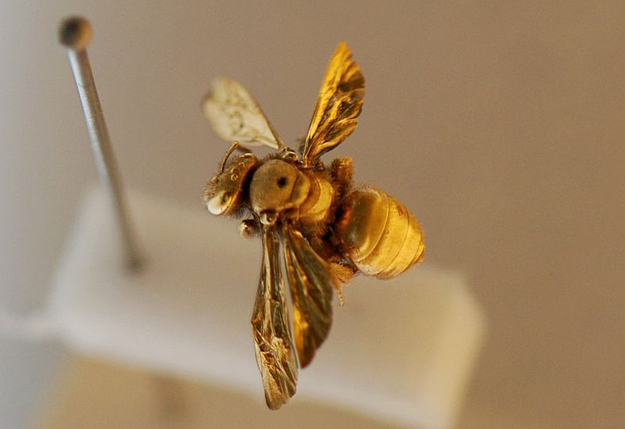

I recently downloaded a trial copy of Mankiw's _Principles of Economics_ from Amazon looking for things to try and explain within the information equilibrium framework. After looking through it again to verify something for [a comment at Noahpinion](http://noahpinionblog.blogspot.com/2016/02/more-on-empirics-in-econ-101.html?showComment=1455493830257#c2523633910714954855) (that it doesn't have any real empirical results in it), I came across an entertaining "just so" story.

In the book is a story on why gold became a standard for money. They ask Sanat Kumar, a chemical engineer at Columbia, which element should be used for money. After throwing out all the reactive and radioactive metals, the gasses, the liquids, the metals with too high a melting point for ancient societies (platinum), and finally the metals that are too rare (osmium), he comes down to gold. It's stable; isn't reactive; isn't radioactive; it's rare, but not too rare.

The thing is that the unmentioned "on the periodic table" and the vague "rare, but not too rare" are really doing most of the work. Many metals react with the oxygen in the atmosphere to form an oxide — but it is usually only a thin surface (zinc oxide, aluminum oxide, copper oxide ... just check the change in your pocket). There aren't too many violently reacting metals (lithium through [cesium](https://www.youtube.com/watch?v=uixxJtJPVXk)). And various alloys could easily fit the bill.

This also leaves off several other desirable properties of money as well: not usable for other purposes (leading to consumption of the medium of exchange/store of value), not too heavy, not in finite supply (resulting in continuous deflation), and easily measurable (assaying metal or detecting counterfeit with fiat currency). 

Actually, the quantum properties of gold turn out to be important — the [plasmon](https://en.wikipedia.org/wiki/Plasmon) frequency of gold is in the visible spectrum making it yellowish as opposed to silvery like most metals. That property coupled with [a touchstone](https://en.wikipedia.org/wiki/Touchstone_\(assaying_tool\)) gave ancient cultures a way of assaying the purity. Without that, no one could really trust the purity and therefore value of your gold — fulfilling the last property above.

In addition, most societies did not use gold as money — they used electrum, copper, bronze, cowrie shells, [bronze cowrie shells](https://zh.wikipedia.org/wiki/%E9%93%9C%E8%B4%9D), [clay tokens](https://informationtransfereconomics.blogspot.com/2017/09/my-introductory-chapter-on-economics.html), paper, etc. In some cases gold was only used for large transactions. In medieval Europe the rarity of gold (and silver and copper) likely inhibited economic development for hundreds of years (see also [here](http://informationtransfereconomics.blogspot.com/2015/09/the-price-revolution-and-non-ideal.html)) — yet rarity is listed as a desirable property in Kumar's list.

In reality, it was the combination of an incorrect theory of value (rarity) and an incorrect theory of macroeconomics ([bullionism](https://en.wikipedia.org/wiki/Bullionism)/[mercantilism](https://en.wikipedia.org/wiki/Mercantilism)) that lead to gold becoming a standard.

PS There is also [my pet theory](http://informationtransfereconomics.blogspot.com/2015/06/the-definition-origin-and-purpose-of.html): no intrinsic value and maximum information entropy.
