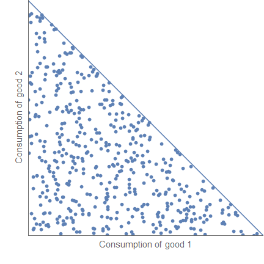
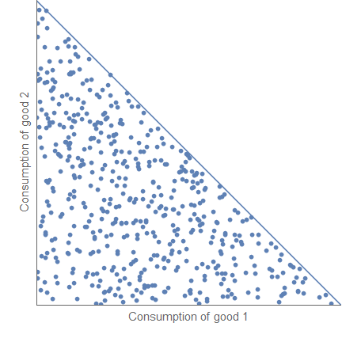
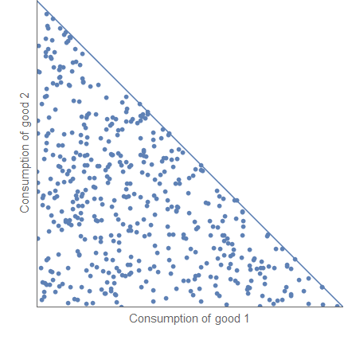
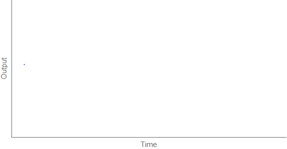

Since [Noah Smith wants to see slides](http://informationtransfereconomics.blogspot.com/2016/02/break-on-through-to-other-side.html), I'm going to try and put some together (in part for [my talk in June](http://informationtransfereconomics.blogspot.com/2016/01/draft-paper-for-talk-this-summer.html)). Here's an animation of when an information equilibrium description of economics would apply for agents that have a choice of two goods with the same price and a budget constraint:

And here's what it could look like if behavioral economics got involved. These could represent a recession (left) or a shift in preferences (right) from both goods to a single good (e.g. betamax vs VHS):

