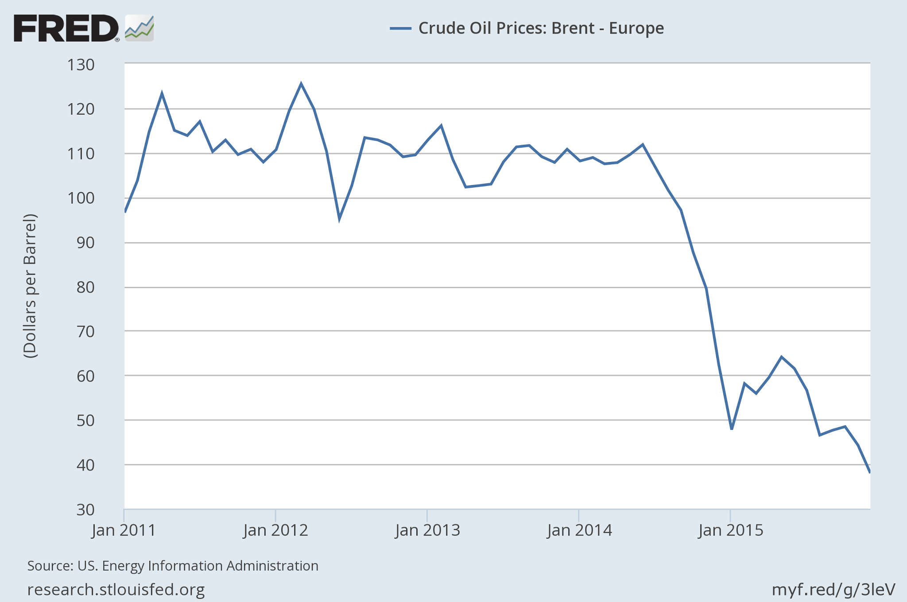

I realized I had forgotten about my prediction (see [here](http://informationtransfereconomics.blogspot.com/2015/01/floating-swiss-franc-wont-change-price.html) and [here](http://informationtransfereconomics.blogspot.com/2015/03/swiss-update.html)) about the Swiss price level after the price ceiling was removed on their currency peg. The IT model predicted no impact. Standard monetary economics predicted deflation. So what was the result? Another win for the IT model.

However when I first looked at the data, I was about to call it for the standard monetary economics. There was deflation since January of 2015 -- at least in the headline HICP (black). But with core HICP (HICP excluding food, energy and tobacco -- core HICP -- gray dashed), we got exactly what was expected by the IT model forecast (blue):

I normalized the two HICP series by scaling the core HICP to minimize their difference between Jan 2011 and Jan 2014. The red lines are just general directions of the impact of imposing and removing a ceiling based on standard monetary economics. The IT model predicted that there would just be a continuation of the slight downward trend.

So what happened? Oil, not monetary policy. The oil price fell drastically, bringing down the headline HICP number:

So standard monetary economics said the price level would rise with a ceiling and fall when it was removed. Neither happened.
