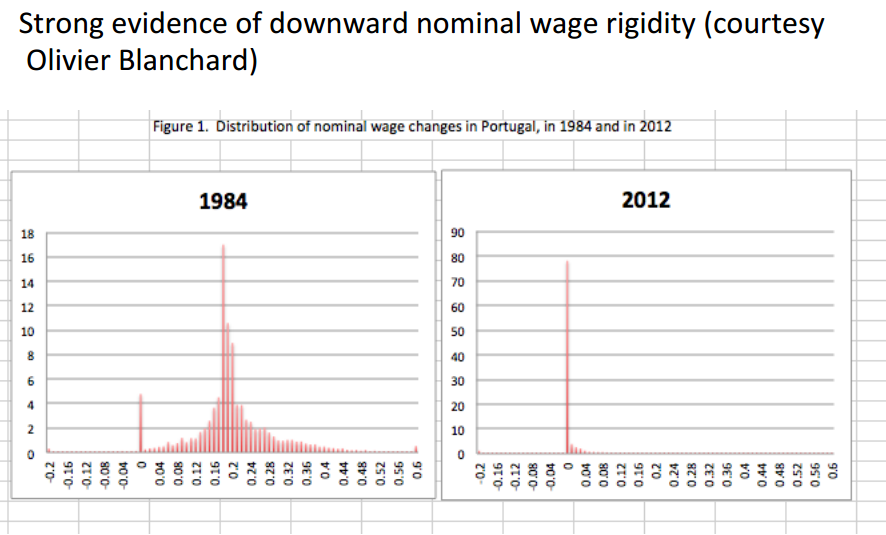
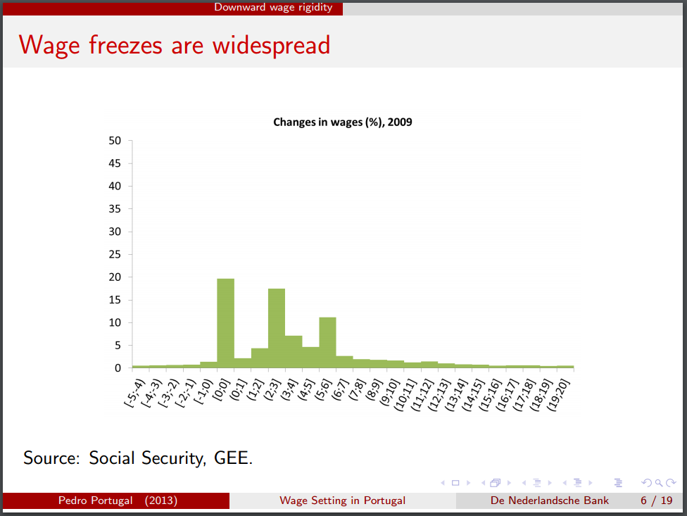
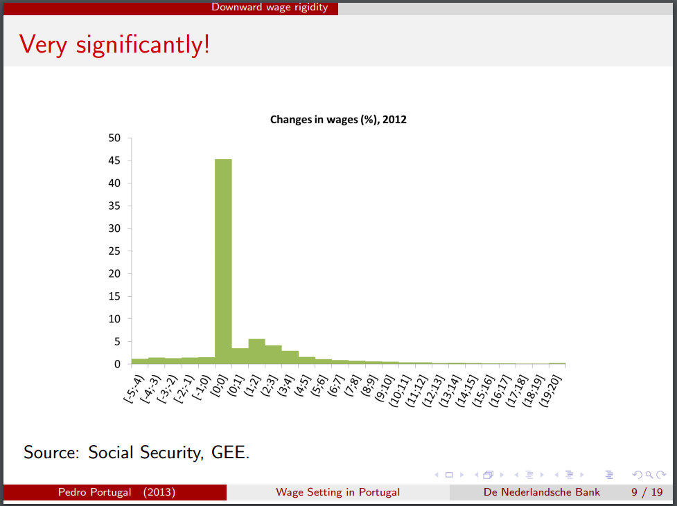

In one of Paul Krugman's presentations about macro \[[pdf](https://webspace.princeton.edu/users/pkrugman/cuny_macro.pdf)\], he presents a picture of nominal wage rigidity:

[this result](http://www.dnb.nl/en/news/news-and-archive/dnbulletin-2013/dnb299408.jsp)

[here \[pdf\]](http://www.dnb.nl/en/binaries/Session%20II%20Wage%20Bargaining%20%20-%20P%20Portugal%20-%20Portual_tcm47-297881.pdf)

I would agree that is some serious nominal wage rigidity! However e.g. the US [doesn't exhibit that magnitude of an effect](http://informationtransfereconomics.blogspot.com/2015/04/micro-stickiness-versus-macro-stickiness.html), so it hardly seems like this would be a general conclusion.
