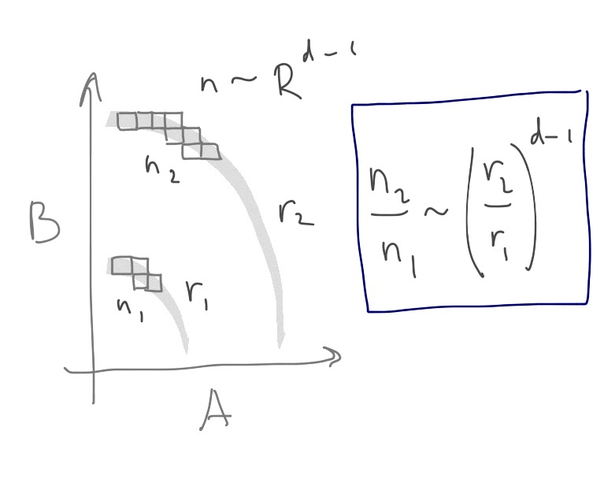
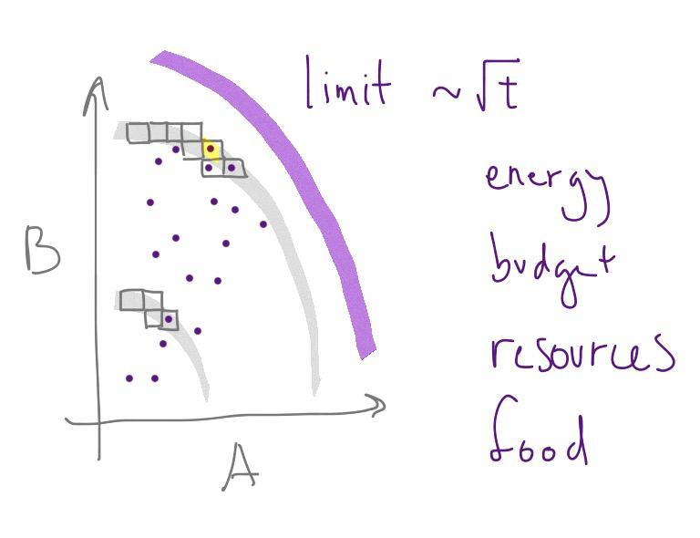
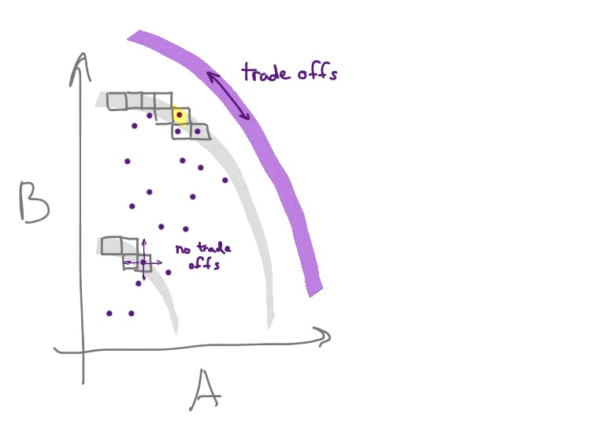

Nick Rowe sent me a link to one of [his posts](http://worthwhile.typepad.com/worthwhile_canadian_initi/2010/06/why-do-economists-assume-tradeoffs.html) alongside [one that used it](https://dynamicecology.wordpress.com/2011/04/27/why-expect-trade-offs-in-ecology-and-evolution/) for an analogy in evolutionary biology. They're both interesting reads, so check them out. I'll wait.

The basic idea is that competition should create a state for an economy or an organism where "fitness" should be maximized (the production possibility frontier saturated). In this state, any further change in production (or adaptations) should lead to trade offs. The organism or economy is at the boundary (set by e.g. energy or resource constraints), so the only states available to move into involve trade-offs.

Eagles as a species have really good eyesight, but can't hunt at night and economies produce the optimal amount of apples and bananas. Night hunting would come at the cost of day hunting and more apples comes at a cost of fewer bananas.

You can visualize both equilibria as the result of optimizing agents. Each eagle in the species tries to maximize food calories and offspring. Each firm in the economy tries to make the most money producing apples and/or bananas.

But you can also visualize both equilibria as the result of a random exploration of the state space -- especially when the fitness or production being optimized has a lot of dimensions (number of traits or number of products). Let me draw a picture:

As the boundary (production possibilities or available food energy) expands, the number of states in a swath near the boundary increases as the distance from the origin: _n ~ Rᵈ⁻¹_. Therefore the number of states at _r₂_ is greater than at _r₁_; if we take _d >> 1_ then most of the states will be near the boundary (in purple below).

And because of that, the economy or species will most likely be in a state near the boundary (e.g. the one highlighted in yellow) after a random walk (purple dots). Those purple dots (economy or species states) are like the pollen grains in Brownian motion with the actions of individual companies or inherited traits of individual organisms being the water molecules randomly moving the pollen from state to state (position to position). That boundary could be due to energy constraints or budget constraints, but it could also be due to insufficient diffusion time (_r ~ √ t_ independent of _d_) to reach states that are further out.

If the reason for the boundary is a constraint (not time), then movements from state to state on the boundary involve trade-offs, while movements in the interior don't -- as illustrated in the next figure.

So we'd expect to see economies and species in states of maximized production and fitness, respectively, experiencing trade-offs between production possibilities and traits, respectively.

_Update 23 April 2017:_ I want to add that most of the states are in that swath near the boundary, so even random movements are more likely to take you to another state in the swath (i.e. a trade-off) rather than inward (fewer states) or outward (probability of occupying a state falls as you move towards or past the boundary) very far. _End update._

However, if the boundary is just time, then there really aren't trade offs. At least at the beginning of life, evolution (state space exploration) was probably limited by the mutation rate. Sexual reproduction (or gene transfer) seems to have enhanced the rate of spreading helpful adaptations, speeding up the state space exploration. But early organisms might not have experienced trade-offs because the state space was wide open. Sure, deleterious mutations would die out, but advantageous mutations did not necessarily come at the expense of another adaptation. However after billions of years, we should probably expect trade-offs between many adaptations.

What about trade-offs in economics? Nick Rowe points out that sometimes there aren't trade-offs (exemplified with fuel injection), but says most of the time we should expect them in a sense for similar reasons in biology: competition and grabbing free lunches. However I'd like to connect this discussion to [David Glasner's macrofoundations](https://uneasymoney.com/2013/10/25/microfoundations-aka-macroeconomic-reductionism-redux/).

What determines the total amount of apples and bananas that can be produced in an economy? The number of people willing to buy and the money available for them to purchase them at the equilibrium prices. By another name: aggregate demand. The PPF for all goods and services is bounded by the total aggregate demand. In the long run, AD grows with time -- meaning that the boundary is just time. In this case there are no trade-offs. The economy can start to just produce more bananas with its economic growth without reducing the number of apples.

In the short run, however, there is an equilibrium level of AD (e.g. the crossing point of an AD-AS model diagram). In this case, there are trade-offs. There is a trade-off even for a linear boundary (e.g. a budget constraint) but let's consider the bowed-out curves illustrated in the pictures above -- corresponding [to upward sloping supply curves](http://informationtransfereconomics.blogspot.com/2016/02/production-possibilities-and-slope-of.html). Rowe [explains](http://worthwhile.typepad.com/worthwhile_canadian_initi/2015/12/ppfs-and-supply-curves.html) the bowed-put PPF in terms of [comparative advantage](https://en.wikipedia.org/wiki/Comparative_advantage) or differences in utilization of [factors of production](https://en.wikipedia.org/wiki/Factors_of_production) (e.g. apples are more labor intensive than bananas).

There's another possible explanation of the bowed-out curve. In the information equilibrium model, information entropy is equivalent to aggregate demand. Therefore the states with higher information entropy (i.e. states with more equal probability of finding apples and bananas) have higher AD relative to states with lower entropy (i.e. states with higher probability of finding either apples or bananas). Therefore AD near the middle of the PPF is slightly higher. This leads to a bowed-out PPF and upward sloping supply curves.

Regardless of how you obtain it, the bowed-out curve -- plus the trade-offs and maximization at the (short run) equilibrium value of AD -- can be effectively described in terms of rational maximizing agents. But all of those properties follow from the macroeconomic conditions \[and large number of products in the macroeconomy\] describing the existence of a boundary \[and giving reasons for being near it\]. Without that bowed-out PPF, there are no trade-offs, no upward sloping supply curves, and no maximizing. These properties of rational agents are dependent on macrofoundations! And they only exist for small perturbations around the PPF established by that short run equilibrium value of aggregate demand.

PS I'm not claiming originality here (much is borrowed from Nick Rowe), except for the _d >> 1_ explanation for maximization and the information entropy explanation of the bowed-out AD curve. I was unable to find any references for this particular take on macrofoundations of rational maximizing behavior, but that doesn't mean they don't exist.

...

**Update 13 Feb 2016**

Added a couple sentences to the paragraph on evolution (and the one after it), which seemed a bit of a non sequitur without them. I wrote most of this on my flight home last night, and I forgot to finish up that bit between getting off the plane and posting it on the blog.
