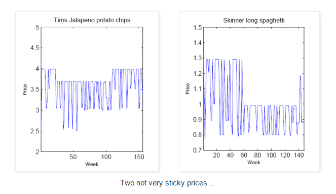
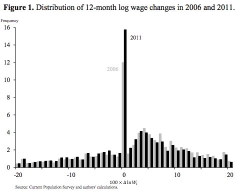

Tyler Cowen [says that it is important](http://marginalrevolution.com/marginalrevolution/2016/02/an-important-new-macro-paper.html) that a paper found dis-aggregated data supported a view that wages are flexible. From that paper:

> _We conclude that the wage stickiness necessary to get demand shocks to be the primary cause of aggregate employment declines during the Great Recession is inconsistent with the flexibility of wages estimated from cross-state variation._

The thing is that when you look at individual prices or wages (i.e. completely dis-aggregated), they're highly flexible. Actually astoundingly so (see Mark Thoma on this [here](http://economistsview.typepad.com/economistsview/2008/03/the-evidence-on.html)):

I'd say that a sudden drop of a price by 30% is not "sticky" in the colloquial sense of the word. The authors of that paper (Martin Eichenbaum, Nir Jaimovich, and Sergio Rebelo) seem to want to hold onto sticky prices, however. Thoma quotes them:

> _We present evidence that is consistent with the view that nominal rigidities are important. However, these rigidities do not take the form of sticky prices, i.e. prices that remain constant over time. Instead, nominal rigidities take the form of inertia in reference prices and costs. Weekly prices and costs fluctuate around reference values which tend to remain constant over extended periods of time._

A reference price with fluctuating sales on and off actually leads to something that looks exactly like a random walk if you average over a moving window. Since most people don't buy Tims potato chips \[above\] or Acme Widgets \[below\] every week, the effective price the consumer market sees is exactly this moving average. Here's an example showing a simulation of some prices that look like those above (blue) alongside a moving average (yellow):

You'd be hard pressed to tell the difference between the yellow line an a random walk. Check out the distribution of price changes of the moving average:

Now let's turn to the distribution of wage changes (from the SF Fed):

There is a big spike at zero -- that increases after recessions. This has been given as empirical evidence of sticky wages. However, only 12-16% of wages fall in this bin. That means 84-88% are changing, and changing by up to 20%! But the key observation is that the distribution of wage changes is not significantly different before and after the recession strikes. As I put it before: [micro wages/prices are flexible, macro wages/prices are sticky](http://informationtransfereconomics.blogspot.com/2015/04/micro-stickiness-versus-macro-stickiness.html) \[1\]. That post has some fun animations explaining the differences.

Since dis-aggregated prices and wages are highly flexible it should come as no surprise that as wage data is dis-aggregated in the paper Cowen cites, the observed macro stickiness fades away. That's because **_macro stickiness is a property of the distribution_** \-- characterized by (in a simple version) its mean and variance. Macro stickiness is the statement that the mean of the distribution doesn't change enough to offset demand shocks. Therefore we end up with unemployment. The distribution of wage changes is the same before and after; only its **_normalization_** has changed.

In this idealized version we have flexible micro wages, but aggregate sticky wages -- therefore observation of flexibility in dis-aggregated data does not disprove sticky macro wages.

In reality, there may be a small change in the mean of that distribution as I talk about in \[1\]. There is also contribution from the change in the zero change bin as well. Markets seem to use all three methods to absorb an aggregate demand shock (I talk more about the other two methods [here](http://informationtransfereconomics.blogspot.com/2014/10/coordination-costs-money-causes.html)). For concreteness, let's say a 9% nominal AD shock ends up with 3% absorbed by wage flexibility, 3% absorbed by zero wage change, and 3% absorbed by unemployment. In this example, only a third manifests as wage flexibility, so the natural complement would be to say two thirds comes from the impact of nominal wage rigidity.

However, if you regionally dis-aggregate the data, that 3% will co-vary with the regional AD shock and it could potentially look like wages are more flexible than they are (as [Scott Sumner points out](http://www.themoneyillusion.com/?p=31475)).
